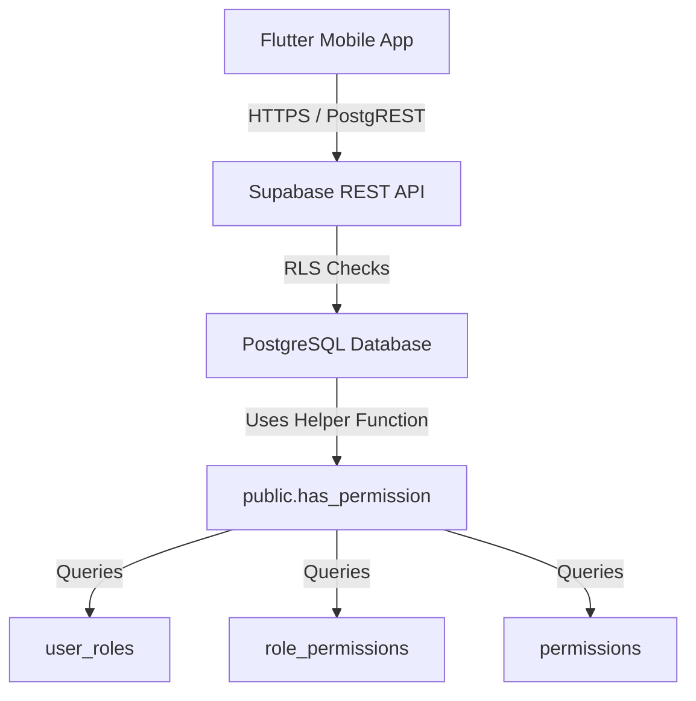
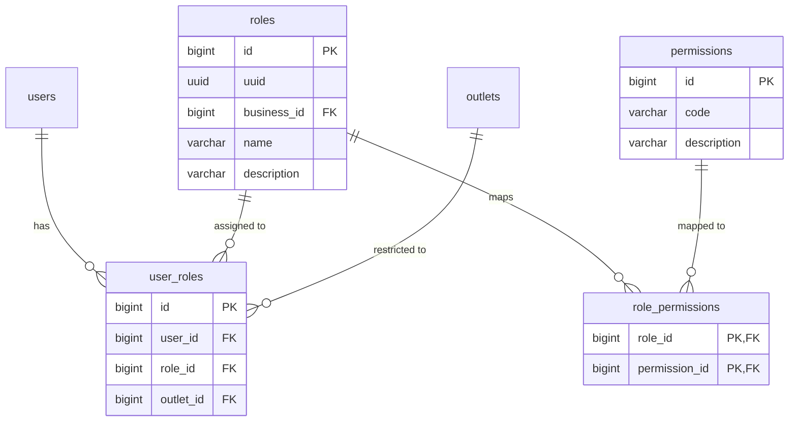
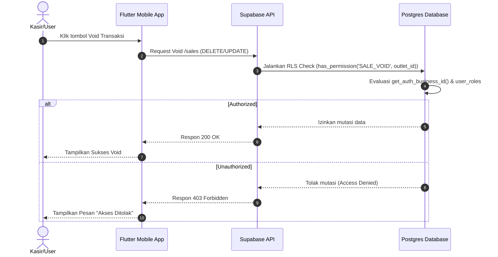

# Design Specification: Identity & Role-Based Access Control (identity-rbac)

## 1. Overview
Desain ini mengimplementasikan sistem **Role-Based Access Control (RBAC)** di Supabase untuk MangRitel. Sistem ini menghubungkan pengguna (`users`) ke peran (`roles`) melalui tabel persimpangan `user_roles`, dan peran tersebut dipetakan ke izin granular (`permissions`) melalui `role_permissions`. Otorisasi ini mendukung isolasi tenant (`business_id`) dan pembatasan peran berdasarkan outlet tertentu (`outlet_id`).

Desain ini menyelesaikan batasan teknis PostgreSQL di mana kolom nullable (`outlet_id`) tidak bisa dijadikan bagian dari Composite Primary Key. Kita akan menggunakan Primary Key pengganti (`id`) dengan Constraint Unique khusus.

## 2. Architecture
Berikut adalah diagram arsitektur tingkat tinggi otorisasi RBAC di Supabase:



## 3. Components and Interfaces

### `public.has_permission(p_permission_code VARCHAR, p_outlet_id BIGINT)`
- **Tanggung Jawab**: Memeriksa apakah user yang terautentikasi memiliki izin tertentu secara global (tingkat bisnis) atau spesifik pada outlet tertentu.
- **Input**:
  - `p_permission_code` (VARCHAR): Kode permission yang divalidasi (mis. 'PRODUCT_CREATE').
  - `p_outlet_id` (BIGINT, Optional): ID outlet tempat aksi dilakukan.
- **Output**: `BOOLEAN` (TRUE jika diizinkan, FALSE jika ditolak).
- **Interaksi**: Mengambil `auth.uid()`, mencocokkannya dengan `users.uuid`, lalu memeriksa relasi `user_roles` -> `role_permissions` -> `permissions`.

### `RLS Policies (Row Level Security)`
- **Tanggung Jawab**: Menyaring baris data di level database sebelum dikirim ke API client.
- **Interaksi**: Memanggil `public.has_permission('PERMISSION_NAME', outlet_id)` pada clause `USING` dan `WITH CHECK` di tabel target (seperti `products`, `stocks`, dsb.).

## 4. Data Models

### Entity Relationship Diagram (RBAC Module)


### PostgreSQL DDL (Supabase Dialect)

```sql
-- Create Permissions Table
CREATE TABLE public.permissions (
    id BIGINT GENERATED BY DEFAULT AS IDENTITY PRIMARY KEY,
    code VARCHAR(100) NOT NULL UNIQUE,
    description VARCHAR(255) NULL,
    created_at TIMESTAMPTZ NOT NULL DEFAULT NOW(),
    updated_at TIMESTAMPTZ NULL
);

-- Create Roles Table
CREATE TABLE public.roles (
    id BIGINT GENERATED BY DEFAULT AS IDENTITY PRIMARY KEY,
    uuid UUID NOT NULL DEFAULT gen_random_uuid() UNIQUE,
    business_id BIGINT REFERENCES public.businesses(id) ON DELETE CASCADE,
    name VARCHAR(50) NOT NULL,
    description VARCHAR(255) NULL,
    created_at TIMESTAMPTZ NOT NULL DEFAULT NOW(),
    created_by VARCHAR(255) NULL,
    updated_at TIMESTAMPTZ NULL,
    updated_by VARCHAR(255) NULL,
    deleted_at TIMESTAMPTZ NULL,
    deleted_by VARCHAR(255) NULL,
    CONSTRAINT uk_roles_business_name UNIQUE (business_id, name)
);

-- Create Role-Permissions Junction Table
CREATE TABLE public.role_permissions (
    role_id BIGINT REFERENCES public.roles(id) ON DELETE CASCADE,
    permission_id BIGINT REFERENCES public.permissions(id) ON DELETE CASCADE,
    PRIMARY KEY (role_id, permission_id)
);

-- Create User-Roles Junction Table
CREATE TABLE public.user_roles (
    id BIGINT GENERATED BY DEFAULT AS IDENTITY PRIMARY KEY,
    user_id BIGINT REFERENCES public.users(id) ON DELETE CASCADE,
    role_id BIGINT REFERENCES public.roles(id) ON DELETE CASCADE,
    outlet_id BIGINT REFERENCES public.outlets(id) ON DELETE CASCADE,
    created_at TIMESTAMPTZ NOT NULL DEFAULT NOW(),
    created_by VARCHAR(255) NULL
);

-- Postgres 15+ Unique Index for Nullable Column in User-Roles
CREATE UNIQUE INDEX idx_user_roles_unique 
ON public.user_roles (user_id, role_id, COALESCE(outlet_id, -1));
```

## 5. Sequence Diagram

### Flow Otorisasi Transaksi POS


## 6. Error Handling Strategy
- **Unique Constraint Violated**: Jika pendaftaran `role` dengan nama yang sama pada bisnis yang sama dicoba, database akan mengembalikan error code `23505` (Unique Violation). API client harus menerjemahkan ini ke pesan error "Nama peran sudah digunakan".
- **Forbidden Action (403)**: RLS policy yang gagal akan menghasilkan error `42501` (insufficient_privilege) dari Supabase. Pada sisi Flutter (GetX), ini akan ditangkap oleh interceptor Repository dan dikonversi menjadi `Failure.unauthorized`.

## 7. Security Considerations
- **Row Level Security (RLS)**: Semua tabel RBAC (`roles`, `permissions`, `role_permissions`, `user_roles`) wajib mengaktifkan RLS.
- **Owner Role Bypass**: User dengan peran 'Owner' otomatis mendapatkan akses penuh tanpa pengecekan permission satuan (bypass logic di fungsi `has_permission`).
- **Data Leak Prevention**: Tabel `user_roles` dilindungi RLS sehingga pengguna hanya bisa melihat data mapping peran miliknya sendiri atau milik rekan kerja satu organisasi (`business_id`).

## 8. Performance Considerations
- **Unique Composite Index**: Pencarian role dan permission menggunakan indeks komposit pada `user_roles` (`user_id, role_id, outlet_id`) untuk kecepatan pencarian linear O(1).
- **Security Definer Caching**: PostgreSQL `SECURITY DEFINER` function dioptimalkan agar menghindari query redundancy dengan caching session variabel Supabase jika diperlukan di masa depan.

## 9. Testing Strategy
- **Unit Test (SQL)**:
  - Melakukan insert data user, role, dan permission dummy, lalu menjalankan asersi `SELECT public.has_permission('TEST_PERM', NULL)` untuk memastikan hak akses global valid.
  - Memastikan user tanpa role tidak dapat mengakses data yang dilindungi RLS.
- **Edge Cases**:
  - Memastikan user dengan role di outlet A tidak dapat menggunakan role tersebut di outlet B.
  - Memastikan system-global roles (di mana `business_id` bernilai `NULL`) dapat dibaca oleh seluruh tenant namun hanya bisa di-update oleh Super Admin.
