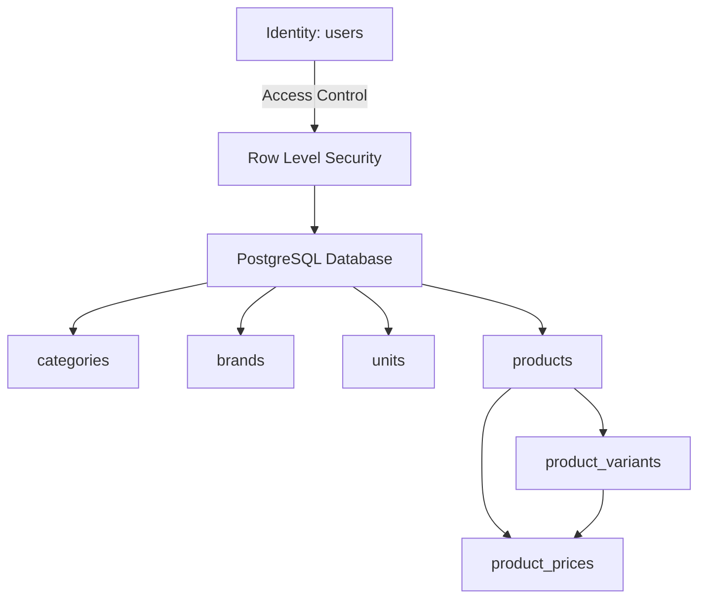
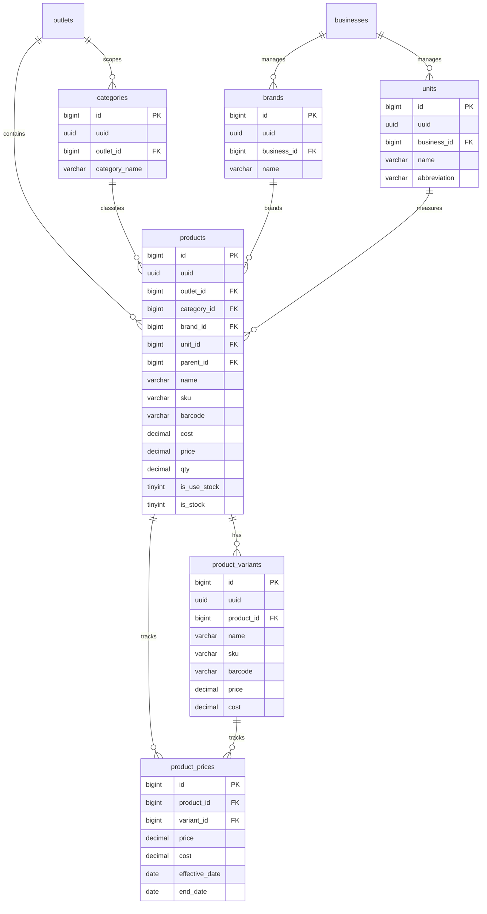

# Design Specification: Product Catalog & Master Data (product-catalog)

## 1. Overview
Desain ini menstrukturkan data katalog produk di Supabase untuk mendukung kebutuhan retail seperti varian terstruktur, merek (brand), satuan ukur standar (unit), dan pencatatan riwayat harga (price history). 

Kita juga merancang trigger otomatis di tingkat database untuk mencatat riwayat harga setiap kali harga jual atau harga beli (cost) pada tabel produk/varian berubah.

## 2. Architecture
Hubungan arsitektur modul katalog produk:



## 3. Components and Interfaces

### `Trigger: trg_sync_product_price`
- **Tanggung Jawab**: Mendeteksi perubahan pada kolom `price` atau `cost` di tabel `products` dan otomatis mencatat perubahan tersebut ke tabel `product_prices` untuk audit histori harga.
- **Tipe**: AFTER INSERT OR UPDATE on `public.products`.

### `Trigger: trg_sync_variant_price`
- **Tanggung Jawab**: Mendeteksi perubahan pada kolom `price` atau `cost` di tabel `product_variants` dan otomatis mencatat ke tabel `product_prices`.
- **Tipe**: AFTER INSERT OR UPDATE on `public.product_variants`.

## 4. Data Models

### Entity Relationship Diagram


### DDL Migrasi (PostgreSQL/Supabase)

```sql
-- 1. Rename dan sesuaikan product_cats ke categories
ALTER TABLE public.product_cats RENAME TO categories;
ALTER TABLE public.categories RENAME COLUMN name TO category_name;
ALTER TABLE public.categories ADD COLUMN IF NOT EXISTS uuid UUID NOT NULL DEFAULT gen_random_uuid() UNIQUE;
ALTER TABLE public.categories ADD COLUMN IF NOT EXISTS deleted_at TIMESTAMPTZ;

-- 2. Buat tabel brands
CREATE TABLE public.brands (
    id BIGINT GENERATED BY DEFAULT AS IDENTITY PRIMARY KEY,
    uuid UUID NOT NULL DEFAULT gen_random_uuid() UNIQUE,
    business_id BIGINT REFERENCES public.businesses(id) ON DELETE CASCADE,
    name VARCHAR(100) NOT NULL,
    created_at TIMESTAMPTZ NOT NULL DEFAULT NOW(),
    created_by VARCHAR(255) NULL,
    updated_at TIMESTAMPTZ NULL,
    updated_by VARCHAR(255) NULL,
    deleted_at TIMESTAMPTZ NULL,
    deleted_by VARCHAR(255) NULL,
    CONSTRAINT uk_brands_business_name UNIQUE (business_id, name)
);

-- 3. Buat tabel units
CREATE TABLE public.units (
    id BIGINT GENERATED BY DEFAULT AS IDENTITY PRIMARY KEY,
    uuid UUID NOT NULL DEFAULT gen_random_uuid() UNIQUE,
    business_id BIGINT REFERENCES public.businesses(id) ON DELETE CASCADE,
    name VARCHAR(50) NOT NULL,
    abbreviation VARCHAR(10) NULL,
    created_at TIMESTAMPTZ NOT NULL DEFAULT NOW(),
    created_by VARCHAR(255) NULL,
    updated_at TIMESTAMPTZ NULL,
    updated_by VARCHAR(255) NULL,
    deleted_at TIMESTAMPTZ NULL,
    deleted_by VARCHAR(255) NULL,
    CONSTRAINT uk_units_business_name UNIQUE (business_id, abbreviation)
);

-- 4. Modifikasi kolom products lama
ALTER TABLE public.products 
    RENAME COLUMN guid TO uuid;

-- Tambah kolom relasi & audit baru
ALTER TABLE public.products
    ADD COLUMN IF NOT EXISTS brand_id BIGINT REFERENCES public.brands(id) ON DELETE SET NULL,
    ADD COLUMN IF NOT EXISTS unit_id BIGINT REFERENCES public.units(id) ON DELETE SET NULL,
    ADD COLUMN IF NOT EXISTS deleted_at TIMESTAMPTZ;

-- Ubah tipe data kolom agar presisi & sesuai standar retail
ALTER TABLE public.products 
    ALTER COLUMN cost TYPE DECIMAL(15,2),
    ALTER COLUMN price TYPE DECIMAL(15,2),
    ALTER COLUMN qty TYPE DECIMAL(18,4);

-- Tambahkan UNIQUE constraint sku per outlet
ALTER TABLE public.products 
    ADD CONSTRAINT uk_products_outlet_sku UNIQUE (outlet_id, sku);

-- 5. Buat tabel product_variants
CREATE TABLE public.product_variants (
    id BIGINT GENERATED BY DEFAULT AS IDENTITY PRIMARY KEY,
    uuid UUID NOT NULL DEFAULT gen_random_uuid() UNIQUE,
    product_id BIGINT NOT NULL REFERENCES public.products(id) ON DELETE CASCADE,
    name VARCHAR(100) NOT NULL,
    sku VARCHAR(255) NULL,
    barcode VARCHAR(255) NULL,
    price DECIMAL(15,2) NOT NULL DEFAULT 0,
    cost DECIMAL(15,2) NOT NULL DEFAULT 0,
    created_at TIMESTAMPTZ NOT NULL DEFAULT NOW(),
    created_by VARCHAR(255) NULL,
    updated_at TIMESTAMPTZ NULL,
    updated_by VARCHAR(255) NULL,
    deleted_at TIMESTAMPTZ NULL,
    deleted_by VARCHAR(255) NULL
);

-- 6. Buat tabel product_prices
CREATE TABLE public.product_prices (
    id BIGINT GENERATED BY DEFAULT AS IDENTITY PRIMARY KEY,
    product_id BIGINT NOT NULL REFERENCES public.products(id) ON DELETE CASCADE,
    variant_id BIGINT REFERENCES public.product_variants(id) ON DELETE CASCADE,
    price DECIMAL(15,2) NOT NULL,
    cost DECIMAL(15,2) NOT NULL,
    effective_date DATE NOT NULL DEFAULT CURRENT_DATE,
    end_date DATE NULL,
    created_at TIMESTAMPTZ NOT NULL DEFAULT NOW()
);
```

## 5. Security & RLS Considerations
Seluruh tabel katalog produk mengaktifkan RLS dengan kebijakan filter:
- **Tingkat Bisnis (brands, units)**: `business_id = get_auth_business_id()`.
- **Tingkat Outlet (categories, products)**: `outlet_id IN (SELECT outlet_id FROM user_has_outlet WHERE user_id = (SELECT id FROM users WHERE uuid = auth.uid()))`.
- Hal ini menjamin kasir di cabang A tidak bisa melihat stok cabang B secara tidak sah.

## 6. Error & Performance Strategy
- **Index**: Menambahkan indeks komposit pada `products (outlet_id, barcode)` dan `product_variants (product_id)` untuk mempercepat pencarian item di kasir saat melakukan scanning barcode.
- **Trigger Histori**: Trigger secara otomatis menutup record harga lama dengan mengisi `end_date = CURRENT_DATE - 1` setiap kali record harga baru di-insert.
