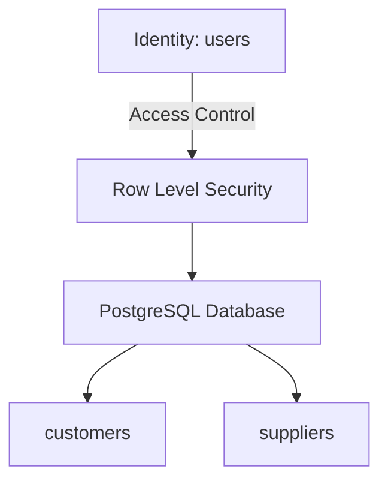
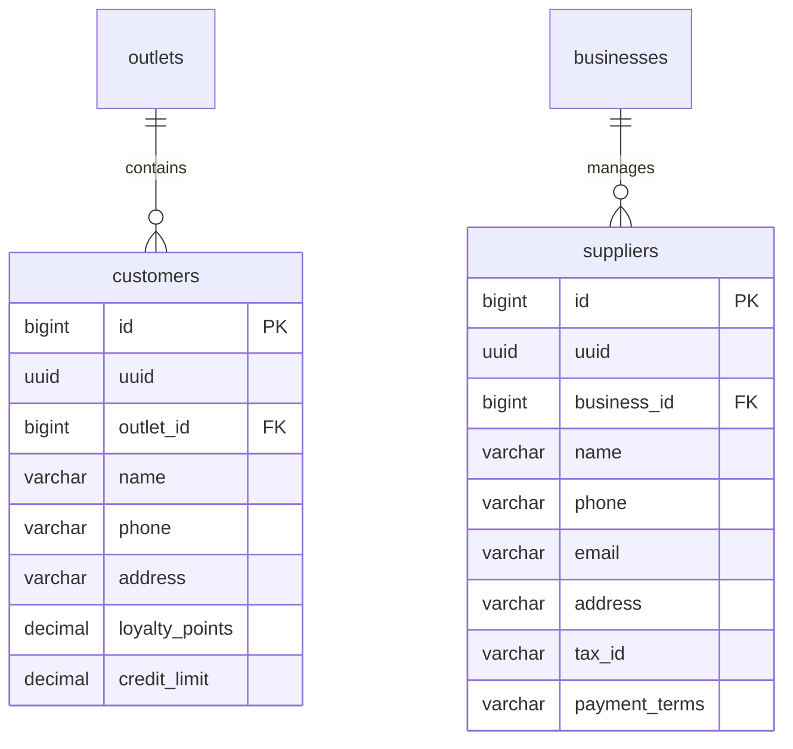

# Design Specification: Customer Relationship Management (crm)

## 1. Overview
Desain ini mengimplementasikan pembaruan tabel `customers` dan pembuatan tabel `suppliers` di database Supabase MangRitel. 

Kita akan mengamankan data `customers` di level **outlet** (hanya kasir/staf outlet tersebut yang bisa melihat pelanggan cabang tersebut) dan data `suppliers` di level **bisnis/tenant** (berbagi katalog pemasok di antara seluruh outlet dalam satu bisnis).

## 2. Architecture
Hubungan arsitektur modul CRM:



## 3. Components and Interfaces

### `public.customers`
- **Tanggung Jawab**: Menyimpan profil pelanggan, poin loyalitas, dan batas piutang untuk transaksi POS.
- **Scope Otorisasi**: Outlet-level (RLS disaring via `public.user_has_outlet_access(outlet_id)`).

### `public.suppliers`
- **Tanggung Jawab**: Menyimpan data distributor/supplier barang untuk transaksi PO.
- **Scope Otorisasi**: Business-level (RLS disaring via `public.get_auth_business_id()`).

## 4. Data Models

### Entity Relationship Diagram


### PostgreSQL DDL (Supabase Dialect)

```sql
-- 1. Modifikasi tabel customers legacy
-- Drop existing constraints jika ada
ALTER TABLE public.customers DROP CONSTRAINT IF EXISTS uk_customers_uuid;
ALTER TABLE public.customers DROP CONSTRAINT IF EXISTS uk_customers_outlet_phone;

-- Rename kolom dan standardisasi audit kolom
ALTER TABLE public.customers 
    RENAME COLUMN store_id TO outlet_id;

ALTER TABLE public.customers 
    RENAME COLUMN createdat TO created_at;
ALTER TABLE public.customers 
    RENAME COLUMN createdby TO created_by;
ALTER TABLE public.customers 
    RENAME COLUMN updatedat TO updated_at;
ALTER TABLE public.customers 
    RENAME COLUMN updatedby TO updated_by;

-- Tambahkan uuid dan deleted_at
ALTER TABLE public.customers 
    ADD COLUMN IF NOT EXISTS uuid UUID NOT NULL DEFAULT gen_random_uuid() UNIQUE,
    ADD COLUMN IF NOT EXISTS deleted_at TIMESTAMPTZ;

-- Konversi data boolean 'deleted' ke 'deleted_at'
UPDATE public.customers SET deleted_at = NOW() WHERE deleted = true;
ALTER TABLE public.customers DROP COLUMN IF EXISTS deleted;

-- Sesuaikan tipe data decimal
ALTER TABLE public.customers 
    ALTER COLUMN loyalty_points TYPE DECIMAL(15,2),
    ALTER COLUMN credit_limit TYPE DECIMAL(15,2);

-- Tambahkan Unique constraint (outlet_id, phone)
ALTER TABLE public.customers 
    ADD CONSTRAINT uk_customers_outlet_phone UNIQUE (outlet_id, phone);

-- Tambahkan FK constraint ke outlets
ALTER TABLE public.customers 
    ADD CONSTRAINT fk_customers_outlet FOREIGN KEY (outlet_id) REFERENCES public.outlets(id) ON DELETE RESTRICT;


-- 2. Buat tabel suppliers baru
CREATE TABLE public.suppliers (
    id BIGINT GENERATED BY DEFAULT AS IDENTITY PRIMARY KEY,
    uuid UUID NOT NULL DEFAULT gen_random_uuid() UNIQUE,
    business_id BIGINT NOT NULL REFERENCES public.businesses(id) ON DELETE CASCADE,
    name VARCHAR(150) NOT NULL,
    phone VARCHAR(20) NULL,
    email VARCHAR(150) NULL,
    address VARCHAR(255) NULL,
    tax_id VARCHAR(50) NULL,
    payment_terms VARCHAR(50) NULL,
    created_at TIMESTAMPTZ NOT NULL DEFAULT NOW(),
    created_by VARCHAR(255) NULL,
    updated_at TIMESTAMPTZ NULL,
    updated_by VARCHAR(255) NULL,
    deleted_at TIMESTAMPTZ NULL,
    deleted_by VARCHAR(255) NULL,
    CONSTRAINT uk_suppliers_business_name UNIQUE (business_id, name)
);

-- Enable RLS
ALTER TABLE public.customers ENABLE ROW LEVEL SECURITY;
ALTER TABLE public.suppliers ENABLE ROW LEVEL SECURITY;
```

## 5. Security & RLS Considerations
- **RLS pada `customers`**:
  - `SELECT/INSERT/UPDATE/DELETE`: Harus memenuhi `public.user_has_outlet_access(outlet_id)` dan permission yang sesuai jika kelak ditambahkan RLS granular.
- **RLS pada `suppliers`**:
  - `SELECT/INSERT/UPDATE/DELETE`: Harus memenuhi `business_id = public.get_auth_business_id()`.

## 6. Performance & Error Considerations
- **Index**: Indeks komposit `(outlet_id, phone)` pada `customers` selain menjamin keunikan juga mempercepat pencarian data pelanggan via nomor telepon di layar kasir.
- **Soft-deletes**: Filter `deleted_at IS NULL` wajib disertakan pada query client untuk mengecualikan data non-aktif.
