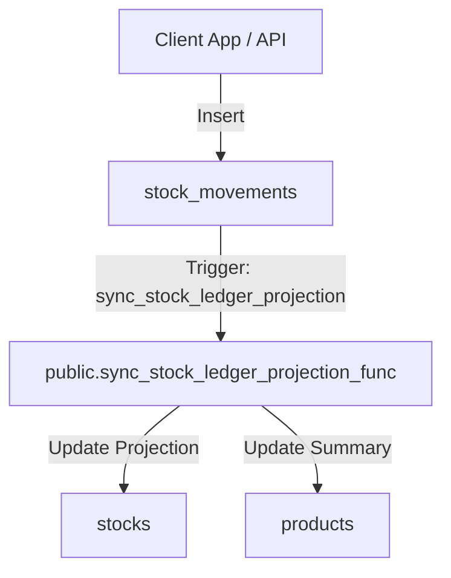
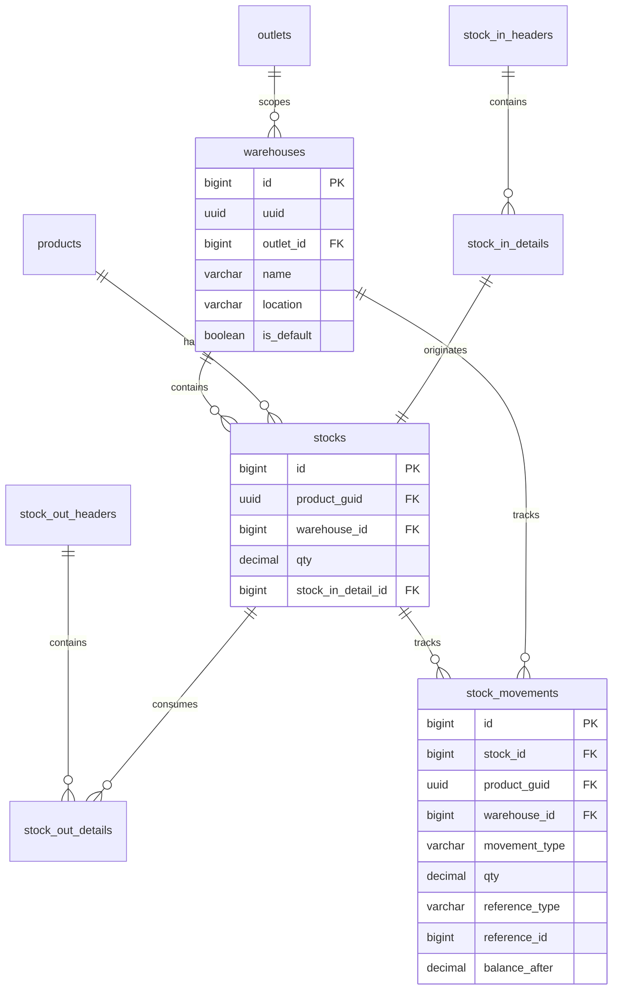

# Design Specification: Inventory Core (04-inventory-core)

## 1. Overview
Desain ini mengimplementasikan sistem manajemen inventaris MangRitel di database Supabase. 

Logika inventaris didesain berbasis **Ledger (stock_movements)** sebagai sumber kebenaran utama (*source of truth*). Setiap kali ada barang masuk atau keluar, sistem akan mencatat baris baru di `stock_movements`, dan sebuah database trigger akan otomatis memperbarui proyeksi stok di tabel `stocks` (stok per batch) dan tabel `products` (total stok ringkas produk).

## 2. Architecture
Alur sinkronisasi stok otomatis berbasis Ledger:



## 3. Components and Interfaces

### `Trigger Function: public.sync_stock_ledger_projection_func()`
- **Tanggung Jawab**: Menjaga proyeksi saldo stok pada tabel `stocks` dan tabel `products` tetap sinkron secara otomatis.
- **Tipe**: AFTER INSERT on `public.stock_movements`.
- **Logika**:
  - Mengambil `warehouse_id`, `product_guid`, `stock_id`, dan `qty` dari pergerakan baru.
  - Menghitung arah pergerakan (masuk = menambah, keluar = mengurangi).
  - Melakukan `UPDATE public.stocks SET qty = qty + (NEW.qty) WHERE id = NEW.stock_id`.
  - Melakukan `UPDATE public.products SET qty = qty + (NEW.qty) WHERE uuid = NEW.product_guid`.

## 4. Data Models

### Entity Relationship Diagram


### PostgreSQL DDL (Supabase Dialect)

```sql
-- 1. Buat tabel warehouses
CREATE TABLE public.warehouses (
    id BIGINT GENERATED BY DEFAULT AS IDENTITY PRIMARY KEY,
    uuid UUID NOT NULL DEFAULT gen_random_uuid() UNIQUE,
    outlet_id BIGINT NOT NULL REFERENCES public.outlets(id) ON DELETE CASCADE,
    name VARCHAR(100) NOT NULL,
    location VARCHAR(255) NULL,
    is_default BOOLEAN NOT NULL DEFAULT FALSE,
    created_at TIMESTAMPTZ NOT NULL DEFAULT NOW(),
    created_by VARCHAR(255) NULL,
    updated_at TIMESTAMPTZ NULL,
    updated_by VARCHAR(255) NULL,
    deleted_at TIMESTAMPTZ NULL,
    deleted_by VARCHAR(255) NULL
);

-- 2. Modifikasi tabel stock_in_headers & stock_in_details
-- Drop constraints lama
ALTER TABLE public.stock_in_details DROP CONSTRAINT IF EXISTS FKariwfcrb1v2kdfd0gfs4km2p0;

-- Sesuaikan kolom stock_in_headers
ALTER TABLE public.stock_in_headers RENAME COLUMN store_id TO outlet_id;
ALTER TABLE public.stock_in_headers 
    ADD COLUMN IF NOT EXISTS uuid UUID NOT NULL DEFAULT gen_random_uuid() UNIQUE,
    ADD COLUMN IF NOT EXISTS goods_receipt_id BIGINT, -- Untuk modul Purchase kelak
    ADD COLUMN IF NOT EXISTS deleted_at TIMESTAMPTZ;

ALTER TABLE public.stock_in_headers RENAME COLUMN createdat TO created_at;
ALTER TABLE public.stock_in_headers RENAME COLUMN createdby TO created_by;
ALTER TABLE public.stock_in_headers RENAME COLUMN updatedat TO updated_at;
ALTER TABLE public.stock_in_headers RENAME COLUMN updatedby TO updated_by;

UPDATE public.stock_in_headers SET deleted_at = NOW() WHERE deleted = true;
ALTER TABLE public.stock_in_headers DROP COLUMN IF EXISTS deleted;

ALTER TABLE public.stock_in_headers ADD CONSTRAINT fk_stock_in_headers_outlet FOREIGN KEY (outlet_id) REFERENCES public.outlets(id) ON DELETE RESTRICT;

-- Sesuaikan kolom stock_in_details
ALTER TABLE public.stock_in_details 
    ALTER COLUMN product_guid TYPE UUID USING product_guid::uuid,
    ALTER COLUMN qty TYPE DECIMAL(18,4),
    ALTER COLUMN cost TYPE DECIMAL(15,2),
    ADD COLUMN IF NOT EXISTS deleted_at TIMESTAMPTZ;

ALTER TABLE public.stock_in_details RENAME COLUMN createdat TO created_at;
ALTER TABLE public.stock_in_details RENAME COLUMN createdby TO created_by;
ALTER TABLE public.stock_in_details RENAME COLUMN updatedat TO updated_at;
ALTER TABLE public.stock_in_details RENAME COLUMN updatedby TO updated_by;

UPDATE public.stock_in_details SET deleted_at = NOW() WHERE deleted = true;
ALTER TABLE public.stock_in_details DROP COLUMN IF EXISTS deleted;

ALTER TABLE public.stock_in_details ADD CONSTRAINT fk_stock_in_details_header FOREIGN KEY (stock_in_header_id) REFERENCES public.stock_in_headers(id) ON DELETE CASCADE;
ALTER TABLE public.stock_in_details ADD CONSTRAINT fk_stock_in_details_product FOREIGN KEY (product_guid) REFERENCES public.products(uuid) ON DELETE CASCADE;


-- 3. Modifikasi tabel stocks
ALTER TABLE public.stocks DROP CONSTRAINT IF EXISTS FKdijuytuiujr2wsyfno5o631oo;

ALTER TABLE public.stocks 
    ALTER COLUMN product_guid TYPE UUID USING product_guid::uuid,
    ALTER COLUMN qty TYPE DECIMAL(18,4),
    ADD COLUMN IF NOT EXISTS warehouse_id BIGINT REFERENCES public.warehouses(id) ON DELETE RESTRICT,
    ADD COLUMN IF NOT EXISTS deleted_at TIMESTAMPTZ;

ALTER TABLE public.stocks RENAME COLUMN createdat TO created_at;
ALTER TABLE public.stocks RENAME COLUMN createdby TO created_by;
ALTER TABLE public.stocks RENAME COLUMN updatedat TO updated_at;
ALTER TABLE public.stocks RENAME COLUMN updatedby TO updated_by;

UPDATE public.stocks SET deleted_at = NOW() WHERE deleted = true;
ALTER TABLE public.stocks DROP COLUMN IF EXISTS deleted;

ALTER TABLE public.stocks ADD CONSTRAINT fk_stocks_product FOREIGN KEY (product_guid) REFERENCES public.products(uuid) ON DELETE CASCADE;
ALTER TABLE public.stocks ADD CONSTRAINT fk_stocks_stock_in_detail FOREIGN KEY (stock_in_detail_id) REFERENCES public.stock_in_details(id) ON DELETE CASCADE;


-- 4. Modifikasi tabel stock_out_headers & stock_out_details
ALTER TABLE public.stock_out_details DROP CONSTRAINT IF EXISTS FK71lp6hdkyk6xr4b869ex4g5fg;
ALTER TABLE public.stock_out_details DROP CONSTRAINT IF EXISTS FKaychye6n47rd2l68obho5kfw3;

-- Sesuaikan stock_out_headers
ALTER TABLE public.stock_out_headers RENAME COLUMN store_id TO outlet_id;
ALTER TABLE public.stock_out_headers 
    ADD COLUMN IF NOT EXISTS uuid UUID NOT NULL DEFAULT gen_random_uuid() UNIQUE,
    ADD COLUMN IF NOT EXISTS deleted_at TIMESTAMPTZ;

ALTER TABLE public.stock_out_headers RENAME COLUMN createdat TO created_at;
ALTER TABLE public.stock_out_headers RENAME COLUMN createdby TO created_by;
ALTER TABLE public.stock_out_headers RENAME COLUMN updatedat TO updated_at;
ALTER TABLE public.stock_out_headers RENAME COLUMN updatedby TO updated_by;

UPDATE public.stock_out_headers SET deleted_at = NOW() WHERE deleted = true;
ALTER TABLE public.stock_out_headers DROP COLUMN IF EXISTS deleted;

ALTER TABLE public.stock_out_headers ADD CONSTRAINT fk_stock_out_headers_outlet FOREIGN KEY (outlet_id) REFERENCES public.outlets(id) ON DELETE RESTRICT;

-- Sesuaikan stock_out_details
ALTER TABLE public.stock_out_details 
    ALTER COLUMN product_guid TYPE UUID USING product_guid::uuid,
    ALTER COLUMN qty TYPE DECIMAL(18,4),
    ALTER COLUMN cost TYPE DECIMAL(15,2),
    ADD COLUMN IF NOT EXISTS deleted_at TIMESTAMPTZ;

ALTER TABLE public.stock_out_details RENAME COLUMN createdat TO created_at;
ALTER TABLE public.stock_out_details RENAME COLUMN createdby TO created_by;
ALTER TABLE public.stock_out_details RENAME COLUMN updatedat TO updated_at;
ALTER TABLE public.stock_out_details RENAME COLUMN updatedby TO updated_by;

UPDATE public.stock_out_details SET deleted_at = NOW() WHERE deleted = true;
ALTER TABLE public.stock_out_details DROP COLUMN IF EXISTS deleted;

ALTER TABLE public.stock_out_details ADD CONSTRAINT fk_stock_out_details_header FOREIGN KEY (stock_out_header_id) REFERENCES public.stock_out_headers(id) ON DELETE CASCADE;
ALTER TABLE public.stock_out_details ADD CONSTRAINT fk_stock_out_details_stock FOREIGN KEY (stock_id) REFERENCES public.stocks(id) ON DELETE RESTRICT;
ALTER TABLE public.stock_out_details ADD CONSTRAINT fk_stock_out_details_product FOREIGN KEY (product_guid) REFERENCES public.products(uuid) ON DELETE CASCADE;


-- 5. Buat tabel stock_movements
CREATE TABLE public.stock_movements (
    id BIGINT GENERATED BY DEFAULT AS IDENTITY PRIMARY KEY,
    stock_id BIGINT REFERENCES public.stocks(id) ON DELETE SET NULL,
    product_guid UUID NOT NULL REFERENCES public.products(uuid) ON DELETE CASCADE,
    warehouse_id BIGINT REFERENCES public.warehouses(id) ON DELETE RESTRICT,
    movement_type VARCHAR(20) CHECK (movement_type IN ('in','out','adjustment','transfer')) NOT NULL,
    qty DECIMAL(18,4) NOT NULL, -- Positif untuk masuk, Negatif untuk keluar
    reference_type VARCHAR(50) CHECK (reference_type IN ('purchase','sale','adjustment','opname','return','transfer')) NOT NULL,
    reference_id BIGINT NULL,
    balance_after DECIMAL(18,4) NOT NULL,
    created_at TIMESTAMPTZ NOT NULL DEFAULT NOW(),
    created_by VARCHAR(255) NULL
);

-- Enable RLS
ALTER TABLE public.warehouses ENABLE ROW LEVEL SECURITY;
ALTER TABLE public.stocks ENABLE ROW LEVEL SECURITY;
ALTER TABLE public.stock_in_headers ENABLE ROW LEVEL SECURITY;
ALTER TABLE public.stock_in_details ENABLE ROW LEVEL SECURITY;
ALTER TABLE public.stock_out_headers ENABLE ROW LEVEL SECURITY;
ALTER TABLE public.stock_out_details ENABLE ROW LEVEL SECURITY;
ALTER TABLE public.stock_movements ENABLE ROW LEVEL SECURITY;
```

## 5. Security & RLS Considerations
Seluruh RLS policies diselaraskan menggunakan helper outlet access yang sudah kita buat sebelumnya (`public.user_has_outlet_access`):
- `warehouses`, `stock_in_headers`, `stock_out_headers`: Memeriksa access terhadap `outlet_id`.
- `stocks`, `stock_in_details`, `stock_out_details`, `stock_movements`: Memeriksa access terhadap `warehouse_id` atau `outlet_id` melalui join query yang aman.
