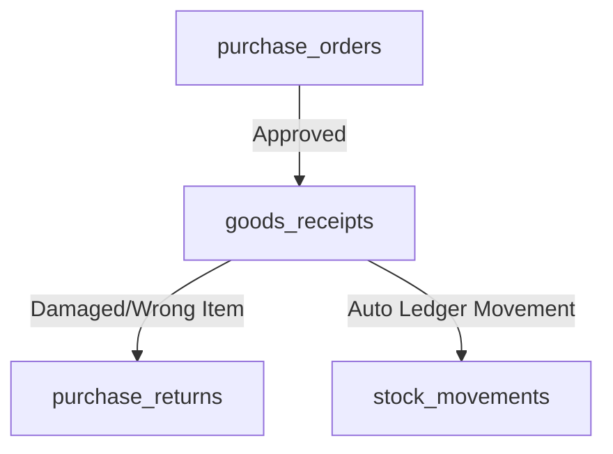
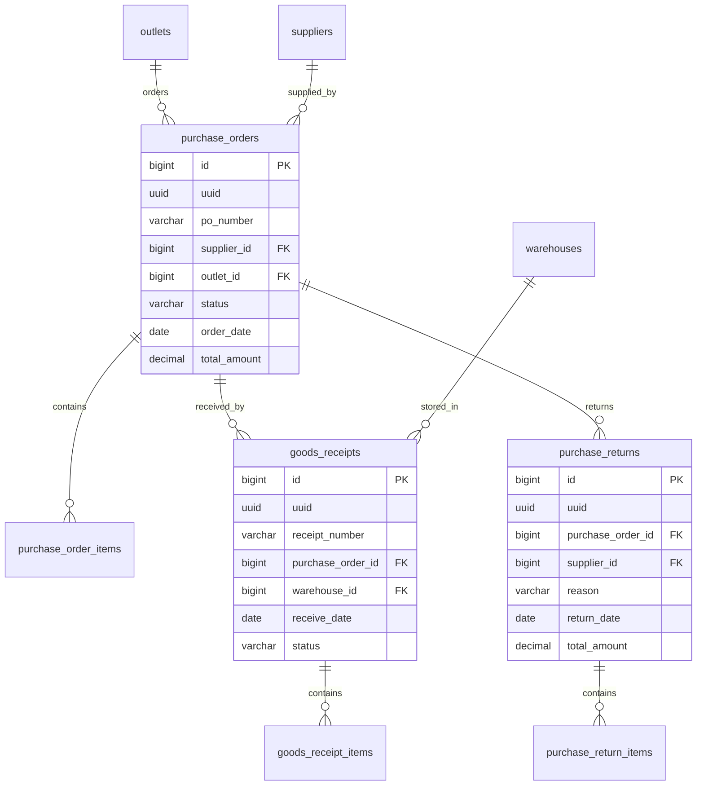

# Design Specification: Purchase & Procurement (05-purchase)

## 1. Overview
Desain ini mengimplementasikan sistem pengadaan barang (procurement) untuk MangRitel di database Supabase. Modul ini menyediakan tabel pesanan pembelian (`purchase_orders`), penerimaan barang (`goods_receipts`), retur pembelian (`purchase_returns`), serta sub-tabel detail item masing-masing.

Semua data diikat secara aman di level **outlet** atau **bisnis** (untuk supplier) sehingga Row Level Security (RLS) terisolasi per-cabang.

## 2. Architecture
Siklus Pengadaan Barang:



## 3. Components and Interfaces

### `public.purchase_orders` & `public.purchase_order_items`
- **Tanggung Jawab**: Menyimpan data order barang ke supplier dari outlet tertentu.
- **RLS**: Membatasi akses SELECT/INSERT/UPDATE/DELETE berdasarkan `public.user_has_outlet_access(outlet_id)`.

### `public.goods_receipts` & `public.goods_receipt_items`
- **Tanggung Jawab**: Menyimpan data kedatangan fisik barang di gudang (`warehouse_id`) berdasarkan PO.
- **RLS**: Membatasi akses berdasarkan gudang cabang terkait.

### `public.purchase_returns` & `public.purchase_return_items`
- **Tanggung Jawab**: Menyimpan log pengembalian barang retur ke supplier.
- **RLS**: Membatasi akses berdasarkan outlet terkait.

## 4. Data Models

### Entity Relationship Diagram


### PostgreSQL DDL (Supabase Dialect)

```sql
-- 1. Tabel purchase_orders
CREATE TABLE public.purchase_orders (
    id BIGINT GENERATED BY DEFAULT AS IDENTITY PRIMARY KEY,
    uuid UUID NOT NULL DEFAULT gen_random_uuid() UNIQUE,
    po_number VARCHAR(50) NOT NULL UNIQUE,
    supplier_id BIGINT NOT NULL REFERENCES public.suppliers(id) ON DELETE RESTRICT,
    outlet_id BIGINT NOT NULL REFERENCES public.outlets(id) ON DELETE RESTRICT,
    status VARCHAR(50) CHECK (status IN ('draft','approved','partially_received','received','cancelled')) NOT NULL DEFAULT 'draft',
    order_date DATE NOT NULL DEFAULT CURRENT_DATE,
    total_amount DECIMAL(15,2) NOT NULL DEFAULT 0,
    notes TEXT NULL,
    created_at TIMESTAMPTZ NOT NULL DEFAULT NOW(),
    created_by VARCHAR(255) NULL,
    updated_at TIMESTAMPTZ NULL,
    updated_by VARCHAR(255) NULL,
    deleted_at TIMESTAMPTZ NULL,
    deleted_by VARCHAR(255) NULL
);

-- 2. Tabel purchase_order_items
CREATE TABLE public.purchase_order_items (
    id BIGINT GENERATED BY DEFAULT AS IDENTITY PRIMARY KEY,
    purchase_order_id BIGINT NOT NULL REFERENCES public.purchase_orders(id) ON DELETE CASCADE,
    product_id BIGINT NOT NULL REFERENCES public.products(id) ON DELETE RESTRICT,
    product_name VARCHAR(255) NULL, -- Snapshot nama produk saat diorder
    qty DECIMAL(18,4) NOT NULL,
    cost DECIMAL(15,2) NOT NULL,
    subtotal DECIMAL(15,2) NOT NULL
);

-- 3. Tabel goods_receipts
CREATE TABLE public.goods_receipts (
    id BIGINT GENERATED BY DEFAULT AS IDENTITY PRIMARY KEY,
    uuid UUID NOT NULL DEFAULT gen_random_uuid() UNIQUE,
    receipt_number VARCHAR(50) NOT NULL UNIQUE,
    purchase_order_id BIGINT NOT NULL REFERENCES public.purchase_orders(id) ON DELETE RESTRICT,
    warehouse_id BIGINT NOT NULL REFERENCES public.warehouses(id) ON DELETE RESTRICT,
    receive_date DATE NOT NULL DEFAULT CURRENT_DATE,
    status VARCHAR(50) NOT NULL DEFAULT 'completed',
    notes TEXT NULL,
    created_at TIMESTAMPTZ NOT NULL DEFAULT NOW(),
    created_by VARCHAR(255) NULL,
    updated_at TIMESTAMPTZ NULL,
    updated_by VARCHAR(255) NULL,
    deleted_at TIMESTAMPTZ NULL,
    deleted_by VARCHAR(255) NULL
);

-- 4. Tabel goods_receipt_items
CREATE TABLE public.goods_receipt_items (
    id BIGINT GENERATED BY DEFAULT AS IDENTITY PRIMARY KEY,
    goods_receipt_id BIGINT NOT NULL REFERENCES public.goods_receipts(id) ON DELETE CASCADE,
    product_id BIGINT NOT NULL REFERENCES public.products(id) ON DELETE RESTRICT,
    qty DECIMAL(18,4) NOT NULL,
    batch_number VARCHAR(50) NULL,
    expiry_date DATE NULL,
    cost DECIMAL(15,2) NOT NULL
);

-- 5. Tabel purchase_returns
CREATE TABLE public.purchase_returns (
    id BIGINT GENERATED BY DEFAULT AS IDENTITY PRIMARY KEY,
    uuid UUID NOT NULL DEFAULT gen_random_uuid() UNIQUE,
    purchase_order_id BIGINT NOT NULL REFERENCES public.purchase_orders(id) ON DELETE RESTRICT,
    supplier_id BIGINT NOT NULL REFERENCES public.suppliers(id) ON DELETE RESTRICT,
    reason VARCHAR(255) NOT NULL,
    return_date DATE NOT NULL DEFAULT CURRENT_DATE,
    total_amount DECIMAL(15,2) NOT NULL DEFAULT 0,
    created_at TIMESTAMPTZ NOT NULL DEFAULT NOW(),
    created_by VARCHAR(255) NULL,
    updated_at TIMESTAMPTZ NULL,
    updated_by VARCHAR(255) NULL,
    deleted_at TIMESTAMPTZ NULL,
    deleted_by VARCHAR(255) NULL
);

-- 6. Tabel purchase_return_items
CREATE TABLE public.purchase_return_items (
    id BIGINT GENERATED BY DEFAULT AS IDENTITY PRIMARY KEY,
    purchase_return_id BIGINT NOT NULL REFERENCES public.purchase_returns(id) ON DELETE CASCADE,
    product_id BIGINT NOT NULL REFERENCES public.products(id) ON DELETE RESTRICT,
    qty DECIMAL(18,4) NOT NULL,
    cost DECIMAL(15,2) NOT NULL
);

-- Enable RLS
ALTER TABLE public.purchase_orders ENABLE ROW LEVEL SECURITY;
ALTER TABLE public.purchase_order_items ENABLE ROW LEVEL SECURITY;
ALTER TABLE public.goods_receipts ENABLE ROW LEVEL SECURITY;
ALTER TABLE public.goods_receipt_items ENABLE ROW LEVEL SECURITY;
ALTER TABLE public.purchase_returns ENABLE ROW LEVEL SECURITY;
ALTER TABLE public.purchase_return_items ENABLE ROW LEVEL SECURITY;
```

## 5. Security & RLS Considerations
- **`purchase_orders` / `purchase_returns`**:
  - `SELECT/INSERT/UPDATE/DELETE`: Harus memenuhi `public.user_has_outlet_access(outlet_id)`.
  - Permission check:
    - Pembuatan PO/Return membutuhkan permission `PURCHASE_CREATE` pada outlet tersebut.
    - Persetujuan/Approval PO membutuhkan permission `PURCHASE_APPROVE` pada outlet tersebut.
- **`goods_receipts`**:
  - Memeriksa gudang: `EXISTS (SELECT 1 FROM public.warehouses w WHERE w.id = warehouse_id AND public.user_has_outlet_access(w.outlet_id))`.
