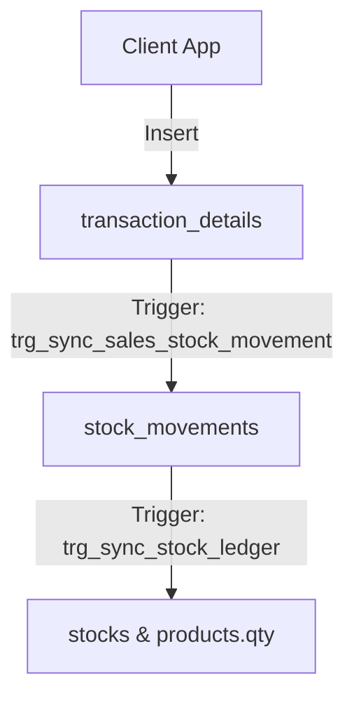
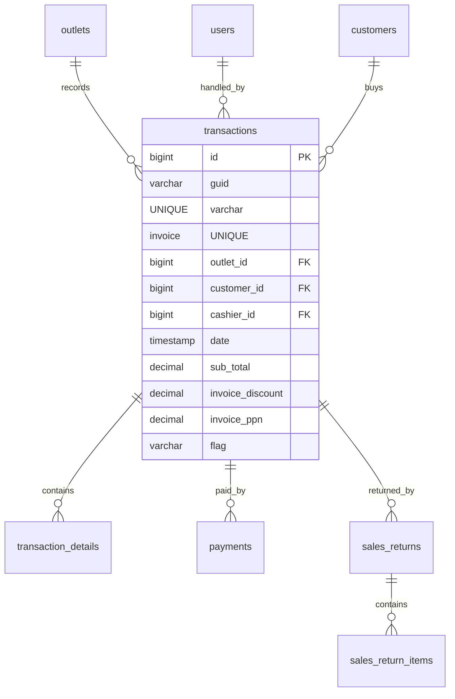

# Design Specification: Sales POS (06-sales-pos)

## 1. Overview
Desain ini mengimplementasikan pembaruan tabel penjualan legacy (`transactions`, `transaction_details`, `payments`) dan penambahan tabel retur penjualan (`sales_returns`, `sales_return_items`) pada database Supabase MangRitel. 

Logika pengurangan stok diselesaikan lewat **Ledger Trigger**: ketika barang terjual, sistem otomatis menulis baris baru bertipe `out` di `stock_movements`. Jika transaksi di-void, trigger pemulih akan menulis baris baru bertipe `in` sebagai jurnal pembalik stok di ledger.

## 2. Architecture
Pencatatan Penjualan & Pemotongan Stok:



## 3. Components and Interfaces

### `Trigger: public.sync_sales_stock_movement_func()`
- **Tipe**: AFTER INSERT on `public.transaction_details`.
- **Tanggung Jawab**: Secara otomatis membuat record `stock_movements` bertipe `out` (qty negatif) untuk mengurangi saldo gudang tempat batch tersebut disimpan.

### `Trigger: public.sync_void_transaction_stock_func()`
- **Tipe**: AFTER UPDATE OF `flag` on `public.transactions`.
- **Tanggung Jawab**: Mendeteksi perubahan flag status transaksi dari `'done'` ke `'void'`. Jika di-void, trigger ini menulis entri pemulihan (`movement_type = 'in'`) di `stock_movements` untuk mengembalikan jumlah stok yang terjual ke batch gudang semula secara bersih.

## 4. Data Models

### Entity Relationship Diagram


### PostgreSQL DDL (Supabase Dialect)

```sql
-- 1. Modifikasi tabel transactions
ALTER TABLE public.payments DROP CONSTRAINT IF EXISTS FKcdww9prd1q98yvhwiy2qpkjfx;
ALTER TABLE public.transaction_details DROP CONSTRAINT IF EXISTS FKf457qf5ukdmtrnooa3080komw;
ALTER TABLE public.transactions DROP CONSTRAINT IF EXISTS UKrbkybdprqkd4nc0r6ps5gunr;
ALTER TABLE public.transactions DROP CONSTRAINT IF EXISTS UKpf7esdu07le5j38c15b7kv997;

-- Ubah columns transactions
ALTER TABLE public.transactions RENAME COLUMN store_id TO outlet_id;
ALTER TABLE public.transactions RENAME COLUMN createdat TO created_at;
ALTER TABLE public.transactions RENAME COLUMN createdby TO created_by;
ALTER TABLE public.transactions RENAME COLUMN updatedat TO updated_at;
ALTER TABLE public.transactions RENAME COLUMN updatedby TO updated_by;

ALTER TABLE public.transactions 
    ALTER COLUMN sub_total TYPE DECIMAL(15,2),
    ALTER COLUMN invoice_discount TYPE DECIMAL(15,2),
    ALTER COLUMN invoice_ppn TYPE DECIMAL(15,2),
    ADD COLUMN IF NOT EXISTS cashier_id BIGINT REFERENCES public.users(id) ON DELETE SET NULL,
    ADD COLUMN IF NOT EXISTS deleted_at TIMESTAMPTZ;

-- Konversi deleted boolean ke deleted_at
UPDATE public.transactions SET deleted_at = NOW() WHERE deleted = TRUE;
ALTER TABLE public.transactions DROP COLUMN IF EXISTS deleted;

-- Tambahkan constraints
ALTER TABLE public.transactions ADD CONSTRAINT uk_transactions_guid UNIQUE (guid);
ALTER TABLE public.transactions ADD CONSTRAINT uk_transactions_invoice UNIQUE (invoice);
ALTER TABLE public.transactions ADD CONSTRAINT fk_transactions_outlet FOREIGN KEY (outlet_id) REFERENCES public.outlets(id) ON DELETE RESTRICT;
ALTER TABLE public.transactions ADD CONSTRAINT fk_transactions_customer FOREIGN KEY (customer_id) REFERENCES public.customers(id) ON DELETE SET NULL;


-- 2. Modifikasi tabel transaction_details
ALTER TABLE public.transaction_details 
    ALTER COLUMN product_guid TYPE UUID USING product_guid::uuid,
    ALTER COLUMN qty TYPE DECIMAL(18,4),
    ALTER COLUMN price TYPE DECIMAL(15,2),
    ALTER COLUMN discount TYPE DECIMAL(15,2),
    ALTER COLUMN ppn TYPE DECIMAL(15,2),
    ALTER COLUMN total_price TYPE DECIMAL(15,2),
    ALTER COLUMN cost TYPE DECIMAL(15,2),
    ADD COLUMN IF NOT EXISTS deleted_at TIMESTAMPTZ;

ALTER TABLE public.transaction_details RENAME COLUMN createdat TO created_at;
ALTER TABLE public.transaction_details RENAME COLUMN createdby TO created_by;
ALTER TABLE public.transaction_details RENAME COLUMN updatedat TO updated_at;
ALTER TABLE public.transaction_details RENAME COLUMN updatedby TO updated_by;

UPDATE public.transaction_details SET deleted_at = NOW() WHERE deleted = TRUE;
ALTER TABLE public.transaction_details DROP COLUMN IF EXISTS deleted;

-- Re-create constraints
ALTER TABLE public.transaction_details ADD CONSTRAINT fk_transaction_details_parent FOREIGN KEY (transaction_guid) REFERENCES public.transactions(guid) ON DELETE CASCADE;
ALTER TABLE public.transaction_details ADD CONSTRAINT fk_transaction_details_product FOREIGN KEY (product_guid) REFERENCES public.products(uuid) ON DELETE RESTRICT;
ALTER TABLE public.transaction_details ADD CONSTRAINT fk_transaction_details_stock FOREIGN KEY (stock_in_id) REFERENCES public.stocks(id) ON DELETE RESTRICT;


-- 3. Modifikasi tabel payments
ALTER TABLE public.payments DROP CONSTRAINT IF EXISTS UKrgqxn64fojs5a58anfn3p0l;

ALTER TABLE public.payments 
    ALTER COLUMN change_amount TYPE DECIMAL(15,2),
    ALTER COLUMN paid TYPE DECIMAL(15,2),
    ALTER COLUMN sub_total TYPE DECIMAL(15,2),
    ADD COLUMN IF NOT EXISTS deleted_at TIMESTAMPTZ;

ALTER TABLE public.payments RENAME COLUMN createdat TO created_at;
ALTER TABLE public.payments RENAME COLUMN createdby TO created_by;
ALTER TABLE public.payments RENAME COLUMN updatedat TO updated_at;
ALTER TABLE public.payments RENAME COLUMN updatedby TO updated_by;

UPDATE public.payments SET deleted_at = NOW() WHERE deleted = TRUE;
ALTER TABLE public.payments DROP COLUMN IF EXISTS deleted;

ALTER TABLE public.payments ADD CONSTRAINT uk_payments_guid UNIQUE (guid);
ALTER TABLE public.payments ADD CONSTRAINT fk_payments_transaction FOREIGN KEY (transaction_guid) REFERENCES public.transactions(guid) ON DELETE CASCADE;


-- 4. Buat tabel sales_returns & sales_return_items baru
CREATE TABLE public.sales_returns (
    id BIGINT GENERATED BY DEFAULT AS IDENTITY PRIMARY KEY,
    uuid UUID NOT NULL DEFAULT gen_random_uuid() UNIQUE,
    transaction_guid VARCHAR(255) NOT NULL REFERENCES public.transactions(guid) ON DELETE RESTRICT,
    reason VARCHAR(255) NOT NULL,
    refund_method VARCHAR(50) CHECK (refund_method IN ('CASH','TRANSFER','STORE_CREDIT')) NOT NULL,
    return_date DATE NOT NULL DEFAULT CURRENT_DATE,
    total_amount DECIMAL(15,2) NOT NULL DEFAULT 0,
    created_at TIMESTAMPTZ NOT NULL DEFAULT NOW(),
    created_by VARCHAR(255) NULL,
    updated_at TIMESTAMPTZ NULL,
    updated_by VARCHAR(255) NULL,
    deleted_at TIMESTAMPTZ NULL,
    deleted_by VARCHAR(255) NULL
);

CREATE TABLE public.sales_return_items (
    id BIGINT GENERATED BY DEFAULT AS IDENTITY PRIMARY KEY,
    sales_return_id BIGINT NOT NULL REFERENCES public.sales_returns(id) ON DELETE CASCADE,
    product_guid UUID NOT NULL REFERENCES public.products(uuid) ON DELETE RESTRICT,
    product_name VARCHAR(255) NULL,
    qty DECIMAL(18,4) NOT NULL,
    price DECIMAL(15,2) NOT NULL
);

-- Enable RLS
ALTER TABLE public.transactions ENABLE ROW LEVEL SECURITY;
ALTER TABLE public.transaction_details ENABLE ROW LEVEL SECURITY;
ALTER TABLE public.payments ENABLE ROW LEVEL SECURITY;
ALTER TABLE public.sales_returns ENABLE ROW LEVEL SECURITY;
ALTER TABLE public.sales_return_items ENABLE ROW LEVEL SECURITY;
```

## 5. Security & RLS Considerations
- **Policies `transactions` / `payments` / `sales_returns`**:
  - `SELECT/INSERT/UPDATE/DELETE`: Berbasis `public.user_has_outlet_access(outlet_id)` (atau melalui join query outlet_id ke transactions untuk payments & sales_returns).
- **Policies `transaction_details` / `sales_return_items`**:
  - Berbasis subquery join ke header `transactions` yang memeriksa outlet akses user.
