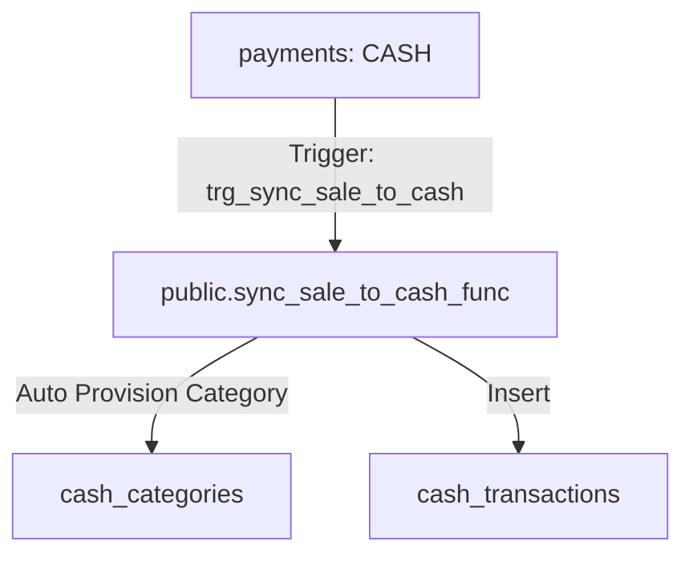
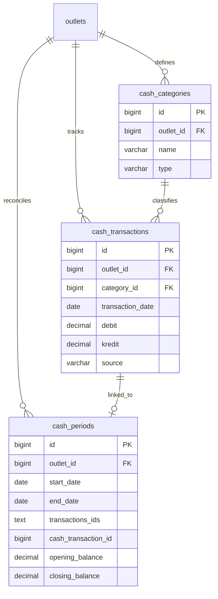

# Design Specification: Finance (07-finance)

## 1. Overview
Desain ini mengimplementasikan pembaruan tabel keuangan MangRitel (`cash_categories`, `cash_transactions`, `cash_periods`) di database Supabase. 

Untuk menjamin konsistensi arus kas masuk dari POS, trigger otomatis akan menangkap setiap pembayaran kasir bertipe `'CASH'` dan langsung mencatatkan jurnal debit di tabel `cash_transactions` di bawah kategori khusus `'Penjualan POS'`. Kategori ini akan otomatis ter-generate jika belum tersedia di outlet tersebut.

## 2. Architecture
Arus Sinkronisasi Transaksi POS ke Jurnal Kas:



## 3. Components and Interfaces

### `Trigger Function: public.sync_sale_to_cash_func()`
- **Tipe**: AFTER INSERT on `public.payments`.
- **Tanggung Jawab**:
  - Menghitung kas bersih yang masuk (`paid - change_amount`).
  - Mengambil data `outlet_id` dari transaksi induk.
  - Memastikan kategori `'Penjualan POS'` aktif untuk outlet tersebut (jika belum, dibuat otomatis).
  - Menyisipkan baris debit baru ke `cash_transactions` berkode source `'SALE'`.

## 4. Data Models

### Entity Relationship Diagram


### PostgreSQL DDL (Supabase Dialect)

```sql
-- 1. Modifikasi tabel cash_categories
ALTER TABLE public.cash_transactions DROP CONSTRAINT IF EXISTS FKngag8gntxjmswsvvj94wi1wso;
ALTER TABLE public.cash_categories DROP CONSTRAINT IF EXISTS fk_cash_categories_outlet;

ALTER TABLE public.cash_categories RENAME COLUMN createdat TO created_at;
ALTER TABLE public.cash_categories RENAME COLUMN createdby TO created_by;
ALTER TABLE public.cash_categories RENAME COLUMN updatedat TO updated_at;
ALTER TABLE public.cash_categories RENAME COLUMN updatedby TO updated_by;

ALTER TABLE public.cash_categories 
    ADD COLUMN IF NOT EXISTS deleted_at TIMESTAMPTZ,
    ALTER COLUMN type TYPE VARCHAR(20);

UPDATE public.cash_categories SET deleted_at = NOW() WHERE deleted = TRUE;
ALTER TABLE public.cash_categories DROP COLUMN IF EXISTS deleted;

ALTER TABLE public.cash_categories ADD CONSTRAINT fk_cash_categories_outlet FOREIGN KEY (outlet_id) REFERENCES public.outlets(id) ON DELETE CASCADE;


-- 2. Modifikasi tabel cash_transactions
ALTER TABLE public.cash_transactions DROP CONSTRAINT IF EXISTS fk_cash_transactions_outlet;
ALTER TABLE public.cash_transactions DROP CONSTRAINT IF EXISTS fk_cash_transactions_category;

ALTER TABLE public.cash_transactions RENAME COLUMN createdat TO created_at;
ALTER TABLE public.cash_transactions RENAME COLUMN createdby TO created_by;
ALTER TABLE public.cash_transactions RENAME COLUMN updatedat TO updated_at;
ALTER TABLE public.cash_transactions RENAME COLUMN updatedby TO updated_by;

ALTER TABLE public.cash_transactions 
    ALTER COLUMN debit TYPE DECIMAL(15,2),
    ALTER COLUMN kredit TYPE DECIMAL(15,2),
    ADD COLUMN IF NOT EXISTS deleted_at TIMESTAMPTZ;

UPDATE public.cash_transactions SET deleted_at = NOW() WHERE deleted = TRUE;
ALTER TABLE public.cash_transactions DROP COLUMN IF EXISTS deleted;

ALTER TABLE public.cash_transactions ADD CONSTRAINT fk_cash_transactions_outlet FOREIGN KEY (outlet_id) REFERENCES public.outlets(id) ON DELETE CASCADE;
ALTER TABLE public.cash_transactions ADD CONSTRAINT fk_cash_transactions_category FOREIGN KEY (category_id) REFERENCES public.cash_categories(id) ON DELETE RESTRICT;


-- 3. Modifikasi tabel cash_periods
ALTER TABLE public.cash_periods RENAME COLUMN createdat TO created_at;
ALTER TABLE public.cash_periods RENAME COLUMN createdby TO created_by;
ALTER TABLE public.cash_periods RENAME COLUMN updatedat TO updated_at;
ALTER TABLE public.cash_periods RENAME COLUMN updatedby TO updated_by;

ALTER TABLE public.cash_periods 
    ALTER COLUMN opening_balance TYPE DECIMAL(15,2),
    ALTER COLUMN closing_balance TYPE DECIMAL(15,2),
    ADD COLUMN IF NOT EXISTS deleted_at TIMESTAMPTZ;

UPDATE public.cash_periods SET deleted_at = NOW() WHERE deleted = TRUE;
ALTER TABLE public.cash_periods DROP COLUMN IF EXISTS deleted;

ALTER TABLE public.cash_periods ADD CONSTRAINT fk_cash_periods_outlet FOREIGN KEY (outlet_id) REFERENCES public.outlets(id) ON DELETE CASCADE;
ALTER TABLE public.cash_periods ADD CONSTRAINT fk_cash_periods_transaction FOREIGN KEY (cash_transaction_id) REFERENCES public.cash_transactions(id) ON DELETE SET NULL;


-- Enable RLS
ALTER TABLE public.cash_categories ENABLE ROW LEVEL SECURITY;
ALTER TABLE public.cash_transactions ENABLE ROW LEVEL SECURITY;
ALTER TABLE public.cash_periods ENABLE ROW LEVEL SECURITY;
```

## 5. Security & RLS Considerations
- **Policies `cash_categories` / `cash_transactions` / `cash_periods`**:
  - `SELECT/INSERT/UPDATE/DELETE`: Berbasis `public.user_has_outlet_access(outlet_id)` agar data keuangan sepenuhnya terisolasi dan hanya dapat dikelola oleh personil cabang yang sah.
  - Untuk modifikasi kas masuk/keluar, kasir dibatasi berdasarkan izin akses keuangan (`has_permission('REPORTS_READ')` atau sejenisnya jika dikembangkan lebih lanjut).
