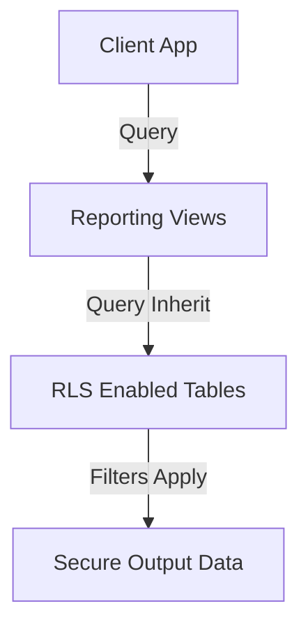

# Design Specification: Reporting & Analytics (08-reporting)

## 1. Overview
Desain ini mengimplementasikan database views di PostgreSQL (Supabase) untuk menyajikan laporan bisnis analitis MangRitel. 

Karena seluruh tabel sumber (`transactions`, `products`, `cash_transactions`, dll.) sudah memiliki Row Level Security (RLS) aktif, maka kueri yang dilakukan oleh client terhadap database views ini secara otomatis mematuhi kebijakan RLS tabel dasar (*Implicit RLS Inherit*).

## 2. Architecture
Arsitektur Laporan berbasis View:



## 3. Components and Interfaces

### `public.view_dashboard_metrics`
- **Tanggung Jawab**: Menyajikan metrik performa hari ini untuk dashboard owner.
- **Kueri**: Mengagregasi data penjualan POS, pembelian PO, dan kas masuk/keluar untuk hari ini.

### `public.view_sales_report`
- **Tanggung Jawab**: Menyediakan histori penjualan POS secara mendalam (omset, HPP/cost, untung bersih per-barang).
- **Kueri**: Menggabungkan `transactions` dengan `transaction_details` dan `products`.

### `public.view_inventory_report`
- **Tanggung Jawab**: Menyediakan status dan nilai aset inventaris saat ini (sisa stok, nilai HPP, potensi penjualan).
- **Kueri**: Menggabungkan `stocks`, `products`, dan `warehouses`.

### `public.view_purchase_report`
- **Tanggung Jawab**: Menyediakan histori pemesanan pengadaan barang ke supplier.
- **Kueri**: Menggabungkan `purchase_orders` dengan `purchase_order_items` dan `suppliers`.

### `public.view_finance_report`
- **Tanggung Jawab**: Menyediakan rekap arus kas masuk (debit) vs kas keluar (kredit) berdasarkan kategori keuangan.
- **Kueri**: Menggabungkan `cash_transactions` dengan `cash_categories`.

## 4. SQL Views Definitions

```sql
-- 1. Dashboard Metrics View
CREATE OR REPLACE VIEW public.view_dashboard_metrics AS
SELECT 
    t.outlet_id,
    COALESCE(SUM(t.sub_total), 0) AS today_sales,
    COALESCE(SUM(
        (SELECT SUM(td.total_price - (td.cost * td.qty)) 
         FROM public.transaction_details td 
         WHERE td.transaction_guid = t.guid AND td.deleted_at IS NULL)
    ), 0) AS today_profit,
    COALESCE((
        SELECT SUM(po.total_amount) 
        FROM public.purchase_orders po 
        WHERE po.outlet_id = t.outlet_id 
          AND po.order_date = CURRENT_DATE 
          AND po.deleted_at IS NULL
    ), 0) AS today_purchase,
    COALESCE((
        SELECT SUM(ct.debit) - SUM(ct.kredit) 
        FROM public.cash_transactions ct 
        WHERE ct.outlet_id = t.outlet_id 
          AND ct.transaction_date = CURRENT_DATE 
          AND ct.deleted_at IS NULL
    ), 0) AS today_net_cash_flow
FROM public.transactions t
WHERE t.date::date = CURRENT_DATE
  AND t.flag = 'done'
  AND t.deleted_at IS NULL
GROUP BY t.outlet_id;


-- 2. Sales Report View
CREATE OR REPLACE VIEW public.view_sales_report AS
SELECT 
    t.outlet_id,
    t.invoice,
    t.date AS transaction_date,
    td.product_guid,
    p.name AS product_name,
    p.sku AS product_sku,
    td.qty AS qty_sold,
    td.price AS unit_price,
    td.discount AS item_discount,
    td.total_price AS subtotal_sales,
    (td.cost * td.qty) AS total_cost_hpp,
    (td.total_price - (td.cost * td.qty)) AS net_profit,
    t.cashier_id,
    u.username AS cashier_name,
    t.customer_id,
    c.name AS customer_name
FROM public.transaction_details td
JOIN public.transactions t ON td.transaction_guid = t.guid
JOIN public.products p ON td.product_guid = p.uuid
LEFT JOIN public.users u ON t.cashier_id = u.id
LEFT JOIN public.customers c ON t.customer_id = c.id
WHERE t.flag = 'done'
  AND t.deleted_at IS NULL
  AND td.deleted_at IS NULL;


-- 3. Inventory Report View
CREATE OR REPLACE VIEW public.view_inventory_report AS
SELECT 
    w.outlet_id,
    w.name AS warehouse_name,
    s.product_guid,
    p.name AS product_name,
    p.sku AS product_sku,
    cat.category_name,
    s.qty AS current_stock,
    p.cost AS unit_cost_hpp,
    p.price AS unit_sales_price,
    (s.qty * p.cost) AS total_asset_cost_hpp,
    (s.qty * p.price) AS total_potential_sales_revenue
FROM public.stocks s
JOIN public.products p ON s.product_guid = p.uuid
JOIN public.warehouses w ON s.warehouse_id = w.id
LEFT JOIN public.categories cat ON p.category_id = cat.id
WHERE s.deleted_at IS NULL
  AND p.deleted_at IS NULL
  AND w.deleted_at IS NULL;


-- 4. Purchase Report View
CREATE OR REPLACE VIEW public.view_purchase_report AS
SELECT 
    po.outlet_id,
    po.po_number,
    po.order_date,
    po.status AS po_status,
    s.name AS supplier_name,
    poi.product_id,
    p.name AS product_name,
    poi.qty AS qty_ordered,
    poi.cost AS unit_cost,
    poi.subtotal AS subtotal_purchase,
    COALESCE((
        SELECT SUM(gri.qty) 
        FROM public.goods_receipt_items gri
        JOIN public.goods_receipts gr ON gri.goods_receipt_id = gr.id
        WHERE gr.purchase_order_id = po.id 
          AND gri.product_id = poi.product_id
          AND gr.deleted_at IS NULL
    ), 0) AS qty_received
FROM public.purchase_order_items poi
JOIN public.purchase_orders po ON poi.purchase_order_id = po.id
JOIN public.suppliers s ON po.supplier_id = s.id
JOIN public.products p ON poi.product_id = p.id
WHERE po.deleted_at IS NULL;


-- 5. Finance Report View
CREATE OR REPLACE VIEW public.view_finance_report AS
SELECT 
    ct.outlet_id,
    ct.transaction_date,
    cc.name AS category_name,
    cc.type AS category_type,
    ct.debit AS cash_in,
    ct.kredit AS cash_out,
    (ct.debit - ct.kredit) AS net_cash_movement,
    ct.description,
    ct.source AS transaction_source
FROM public.cash_transactions ct
JOIN public.cash_categories cc ON ct.category_id = cc.id
WHERE ct.deleted_at IS NULL
  AND cc.deleted_at IS NULL;
```

## 5. Security & RLS Considerations
- **Implicit RLS**: Di PostgreSQL, jika view memanggil tabel yang terproteksi RLS, kueri view oleh client secara otomatis akan ter-filter sesuai policies tabel dasarnya. 
- Sebagai contoh, query pada `view_sales_report` oleh kasir A hanya akan mengembalikan data penjualan di outlet tempat kasir A memiliki otorisasi, karena `transactions` menyaring baris datanya secara otomatis lewat RLS.
- Ini menjamin nol konfigurasi tambahan RLS pada tingkat database view itu sendiri.
