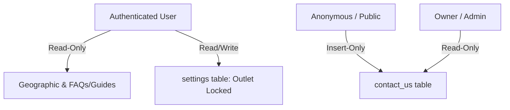

# Design Specification: Settings & References (09-settings-misc)

## 1. Overview
Desain ini mengimplementasikan pembaruan tabel preferensi `settings` (renaming `store_id` -> `outlet_id`) dan konfigurasi Row Level Security (RLS) pada seluruh tabel pendukung/utilitas sistem di Supabase MangRitel.

Pengamanan diatur secara granular: static geographic references terbuka dibaca oleh seluruh user, tabel pengaturan outlet terkunci per-cabang, dan formulir `contact_us` terbuka untuk ditulisi oleh publik namun hanya dapat dibaca oleh Owner/Admin bisnis.

## 2. Architecture
Peta Akses Otorisasi Modul Settings & References:



## 3. Components and Interfaces

### `public.settings`
- **Tanggung Jawab**: Menyimpan preferensi operasional per-cabang (mis. format print struk, PPN aktif).
- **RLS**: Membatasi akses berdasarkan `public.user_has_outlet_access(outlet_id)`.

### `public.contact_us`
- **Tanggung Jawab**: Menampung kiriman kritik/saran prospect dari website umum.
- **RLS**: 
  - `INSERT`: Terbuka untuk umum (`anon` & `authenticated`).
  - `SELECT`: Terkunci hanya untuk user dengan Role `'Owner'` atau `'Administrator'`.

## 4. Data Models & PostgreSQL DDL

```sql
-- 1. Modifikasi tabel settings
ALTER TABLE public.settings DROP CONSTRAINT IF EXISTS FKmnsm95blhmn8yxjlwoasftxpi;
ALTER TABLE public.settings DROP CONSTRAINT IF EXISTS fk_settings_outlet;

ALTER TABLE public.settings RENAME COLUMN store_id TO outlet_id;
ALTER TABLE public.settings RENAME COLUMN createdat TO created_at;
ALTER TABLE public.settings RENAME COLUMN createdby TO created_by;
ALTER TABLE public.settings RENAME COLUMN updatedat TO updated_at;
ALTER TABLE public.settings RENAME COLUMN updatedby TO updated_by;

ALTER TABLE public.settings 
    ADD COLUMN IF NOT EXISTS deleted_at TIMESTAMPTZ;

UPDATE public.settings SET deleted_at = NOW() WHERE deleted = TRUE;
ALTER TABLE public.settings DROP COLUMN IF EXISTS deleted;

ALTER TABLE public.settings ADD CONSTRAINT fk_settings_outlet FOREIGN KEY (outlet_id) REFERENCES public.outlets(id) ON DELETE CASCADE;


-- 2. Aktifkan RLS pada seluruh tabel references & misc
ALTER TABLE public.settings ENABLE ROW LEVEL SECURITY;
ALTER TABLE public.provinces ENABLE ROW LEVEL SECURITY;
ALTER TABLE public.cities ENABLE ROW LEVEL SECURITY;
ALTER TABLE public.districts ENABLE ROW LEVEL SECURITY;
ALTER TABLE public.villages ENABLE ROW LEVEL SECURITY;
ALTER TABLE public.faqs ENABLE ROW LEVEL SECURITY;
ALTER TABLE public.guides ENABLE ROW LEVEL SECURITY;
ALTER TABLE public.contact_us ENABLE ROW LEVEL SECURITY;
ALTER TABLE public.file_uploads ENABLE ROW LEVEL SECURITY;
ALTER TABLE public.affiliators ENABLE ROW LEVEL SECURITY;
ALTER TABLE public.referrals ENABLE ROW LEVEL SECURITY;
```

## 5. Security & RLS Considerations

### RLS untuk preferensi outlet (`settings`)
- `SELECT/INSERT/UPDATE/DELETE`: Berbasis `public.user_has_outlet_access(outlet_id)`.

### RLS untuk data geografis & edukasi (`provinces`, `cities`, `districts`, `villages`, `faqs`, `guides`)
- `SELECT`: Diizinkan untuk semua user terautentikasi (`auth.role() = 'authenticated'`).
- `INSERT/UPDATE/DELETE`: Ditolak untuk semua user biasa (hanya postgres/service_role bypass RLS).

### RLS untuk kontak masuk (`contact_us`)
- `INSERT`: Terbuka untuk umum:
  - `CREATE POLICY insert_contact ON public.contact_us FOR INSERT WITH CHECK (true);`
- `SELECT`: Hanya diizinkan bagi Owner & Administrator:
  - `CREATE POLICY select_contact ON public.contact_us FOR SELECT USING (EXISTS (SELECT 1 FROM public.user_roles ur JOIN public.roles r ON ur.role_id = r.id WHERE ur.user_id = (SELECT id FROM public.users WHERE uuid = auth.uid()) AND r.name IN ('Owner', 'Administrator')));`

### RLS untuk affiliator dan referral (`affiliators`, `referrals`)
- `SELECT`: Diizinkan untuk user terautentikasi (untuk pencocokan kode pendaftaran).
- `INSERT/UPDATE/DELETE`: Terkunci (hanya admin/service_role).
