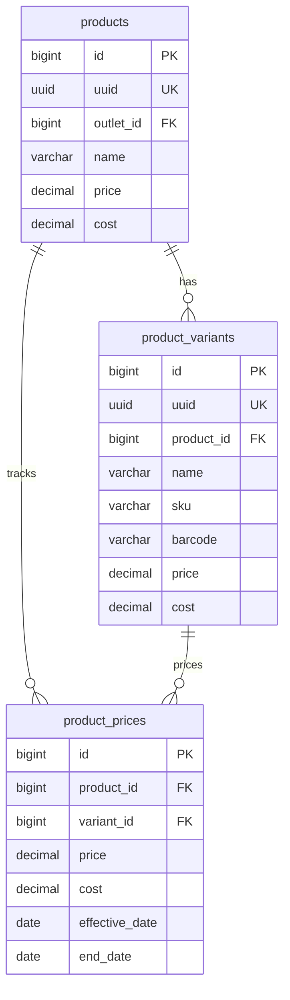

# Design Specification: Product Variants & Price History (11-product-variants)

## 1. Overview
Desain ini mengimplementasikan dua tabel baru yaitu `product_variants` (varian terstruktur produk) dan `product_prices` (riwayat harga produk historis) sesuai desain Eqiozmart v1 bagian **7.5** dan **7.6**.

Tabel `product_prices` juga akan berfungsi sebagai pengganti tabel `product_price_histories` legacy dengan skema yang lebih terstruktur: menambahkan kolom `variant_id` (nullable), `cost` (HPP pada tanggal tersebut), `end_date`, serta `deleted_by`.

## 2. Architecture



## 3. Data Models & PostgreSQL DDL

```sql
-- 1. Buat tabel product_variants
CREATE TABLE IF NOT EXISTS public.product_variants (
    id BIGINT GENERATED BY DEFAULT AS IDENTITY PRIMARY KEY,
    uuid UUID NOT NULL DEFAULT gen_random_uuid() UNIQUE,
    product_id BIGINT NOT NULL REFERENCES public.products(id) ON DELETE CASCADE,
    name VARCHAR(100) NOT NULL,
    sku VARCHAR(255) NULL,
    barcode VARCHAR(255) NULL,
    price DECIMAL(15,2) NOT NULL DEFAULT 0,
    cost DECIMAL(15,2) NOT NULL DEFAULT 0,
    is_active BOOLEAN NOT NULL DEFAULT TRUE,
    created_at TIMESTAMPTZ NOT NULL DEFAULT NOW(),
    created_by VARCHAR(255) NULL,
    updated_at TIMESTAMPTZ NULL,
    updated_by VARCHAR(255) NULL,
    deleted_at TIMESTAMPTZ NULL,
    deleted_by VARCHAR(255) NULL
);

CREATE INDEX IF NOT EXISTS idx_product_variants_product ON public.product_variants (product_id) WHERE deleted_at IS NULL;
CREATE INDEX IF NOT EXISTS idx_product_variants_sku ON public.product_variants (sku) WHERE sku IS NOT NULL AND deleted_at IS NULL;


-- 2. Buat tabel product_prices
CREATE TABLE IF NOT EXISTS public.product_prices (
    id BIGINT GENERATED BY DEFAULT AS IDENTITY PRIMARY KEY,
    product_id BIGINT NOT NULL REFERENCES public.products(id) ON DELETE CASCADE,
    variant_id BIGINT NULL REFERENCES public.product_variants(id) ON DELETE CASCADE,
    price DECIMAL(15,2) NOT NULL,
    cost DECIMAL(15,2) NOT NULL DEFAULT 0,
    effective_date DATE NOT NULL DEFAULT CURRENT_DATE,
    end_date DATE NULL,
    created_at TIMESTAMPTZ NOT NULL DEFAULT NOW(),
    created_by VARCHAR(255) NULL,
    updated_at TIMESTAMPTZ NULL,
    updated_by VARCHAR(255) NULL,
    deleted_at TIMESTAMPTZ NULL,
    deleted_by VARCHAR(255) NULL
);

CREATE INDEX IF NOT EXISTS idx_product_prices_active
    ON public.product_prices (product_id, effective_date DESC)
    WHERE end_date IS NULL AND deleted_at IS NULL;


-- 3. Enable RLS
ALTER TABLE public.product_variants ENABLE ROW LEVEL SECURITY;
ALTER TABLE public.product_prices ENABLE ROW LEVEL SECURITY;
```

## 4. Security & RLS Considerations

### Policies `product_variants` dan `product_prices`
Karena kedua tabel ini berelasi ke `products` (yang sudah ber-`outlet_id`), RLS-nya menggunakan subquery join ke tabel `products`:

```sql
-- SELECT/INSERT/UPDATE/DELETE: join ke products.outlet_id
USING (EXISTS (
    SELECT 1 FROM public.products p
    WHERE p.id = product_id
    AND public.user_has_outlet_access(p.outlet_id)
))
```
