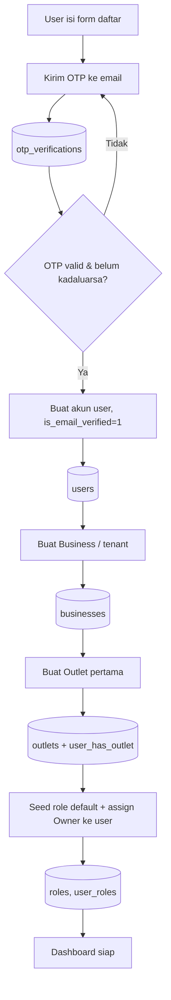
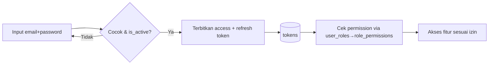
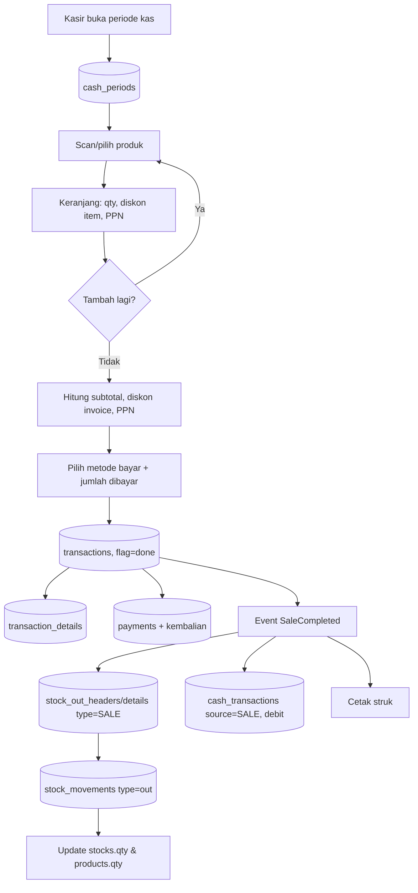
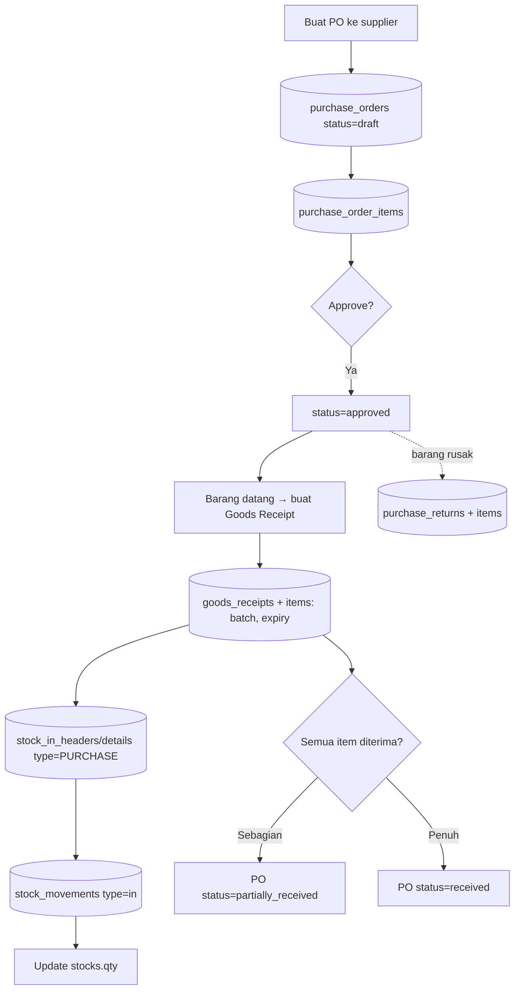
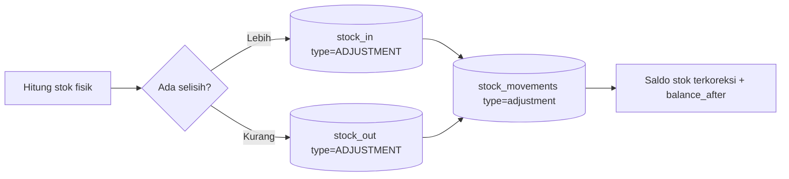
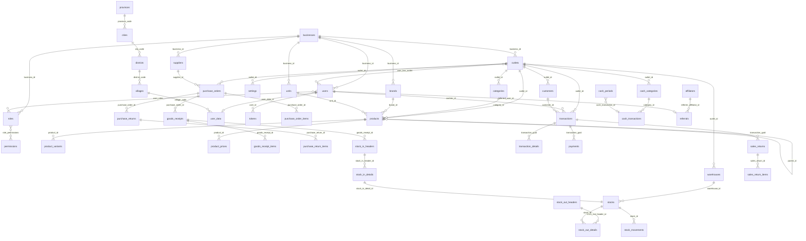

# Perancangan Database Eqiozmart — v1 (Source of Truth)

> **Tujuan:** Dokumen tunggal, lengkap, dan menyeluruh sebagai **acuan utama pengembangan database** Eqiozmart, dari nol sampai akhir.
> Basis = database Mangkasir (`mpos` + `mpos_transaction`) yang sudah teruji, **diperbarui** untuk menutup gap terhadap spec Eqiozmart (lihat `DB_GAP_ANALYSIS_Mangkasir_vs_Eqiozmart.md`).
> Setiap entitas dijabarkan: tujuan, daftar kolom lengkap, tipe data, constraint, relasi, aturan bisnis. DDL siap-jalan ada di **Lampiran A**.

## Daftar Isi
1. [Konvensi & Keputusan Teknis](#1-konvensi--keputusan-teknis)
2. [Daftar Lengkap Entitas](#2-daftar-lengkap-entitas-48-tabel)
3. [User Flow End-to-End](#3-user-flow-end-to-end)
4. [ERD Penuh](#4-erd-penuh)
5. [Modul Identity](#5-modul-identity)
6. [Modul Organization](#6-modul-organization)
7. [Modul Product](#7-modul-product)
8. [Modul CRM](#8-modul-crm)
9. [Modul Purchase](#9-modul-purchase)
10. [Modul Inventory](#10-modul-inventory)
11. [Modul Sales](#11-modul-sales)
12. [Modul Finance](#12-modul-finance)
13. [Modul Settings, Misc & Reference](#13-modul-settings-misc--reference)
14. [Referensi Enum](#14-referensi-enum-terpusat)
15. [State Machine](#15-state-machine)
16. [Aturan Integritas & Index](#16-aturan-integritas--index)
17. [Seed Data Wajib](#17-seed-data-wajib)
18. [Strategi Migrasi dari Mangkasir](#18-strategi-migrasi-dari-mangkasir)
19. [Lampiran A — DDL Lengkap](#lampiran-a--ddl-lengkap-siap-jalan)

---

## 1. Konvensi & Keputusan Teknis

| Aspek | Keputusan | Alasan |
|---|---|---|
| DBMS | **MariaDB/MySQL 11+**, engine **InnoDB** | Existing MariaDB; spec backend MySQL. Referensi Prisma/Postgres diabaikan. |
| Database | **Satu database** `eqiozmart` | Gabung `mpos`+`mpos_transaction`. FK lintas modul jadi mungkin. |
| Charset/Collation | `utf8mb4` / `utf8mb4_uca1400_ai_ci` | Unicode penuh. |
| PK internal | `id BIGINT UNSIGNED AUTO_INCREMENT` | Cepat, internal. |
| ID publik | `uuid CHAR(36)` (unik per aggregate root) | Diekspos ke API; ID internal tak bocor. |
| Uang | `DECIMAL(15,2)` | Hindari `double` (presisi). |
| Kuantitas | `DECIMAL(18,4)` | Dukung satuan pecahan (kg, liter). |
| Boolean | `TINYINT(1)` (0/1) | Konsisten lintas tabel. |
| Waktu | `DATETIME(6)` (presisi mikrodetik) | Sama dengan existing. |
| Soft delete | `deleted_at DATETIME(6) NULL` (NULL=aktif) | Ganti `deleted TINYINT`. |
| Multi-tenant | `business_id` (tenant) → `outlet_id` (sub-tenant) di semua data | Isolasi tenant. |
| Penamaan | `snake_case`, tabel jamak | Mengikuti glossary. |

### 1.1 Blok Kolom Audit Standar
Hadir di **semua** tabel master & transaksi (di spesifikasi per-tabel cukup ditulis "+ audit standar"; di DDL Lampiran A ditulis penuh):

| Kolom | Tipe | Null | Deskripsi |
|---|---|---|---|
| `created_at` | DATETIME(6) | NOT NULL | Waktu pembuatan baris |
| `created_by` | VARCHAR(255) | NULL | User/aktor pembuat |
| `updated_at` | DATETIME(6) | NULL | Waktu perubahan terakhir |
| `updated_by` | VARCHAR(255) | NULL | User/aktor pengubah |
| `deleted_at` | DATETIME(6) | NULL | Waktu soft-delete (NULL = aktif) |
| `deleted_by` | VARCHAR(255) | NULL | User/aktor penghapus |

---

## 2. Daftar Lengkap Entitas (48 Tabel)

| # | Modul | Tabel | Jenis | Asal |
|---|---|---|---|---|
| 1 | Identity | `users` | master | existing (diperbarui) |
| 2 | Identity | `user_data` | master | existing |
| 3 | Identity | `roles` | master | **baru** |
| 4 | Identity | `permissions` | master | **baru** |
| 5 | Identity | `role_permissions` | junction | **baru** |
| 6 | Identity | `user_roles` | junction | **baru** |
| 7 | Identity | `tokens` | transaksi | existing |
| 8 | Identity | `otp_verifications` | transaksi | existing |
| 9 | Organization | `businesses` | master | **baru** |
| 10 | Organization | `outlets` | master | existing (`stores`) |
| 11 | Organization | `user_has_outlet` | junction | existing (`user_has_store`) |
| 12 | Organization | `settings` | master | existing |
| 13 | Product | `categories` | master | existing (`product_cats`) |
| 14 | Product | `brands` | master | **baru** |
| 15 | Product | `units` | master | **baru** |
| 16 | Product | `products` | master | existing (diperbarui) |
| 17 | Product | `product_variants` | master | **baru** |
| 18 | Product | `product_prices` | master | **baru** |
| 19 | CRM | `customers` | master | existing |
| 20 | CRM | `suppliers` | master | **baru** |
| 21 | Purchase | `purchase_orders` | transaksi | **baru** |
| 22 | Purchase | `purchase_order_items` | transaksi | **baru** |
| 23 | Purchase | `goods_receipts` | transaksi | **baru** |
| 24 | Purchase | `goods_receipt_items` | transaksi | **baru** |
| 25 | Purchase | `purchase_returns` | transaksi | **baru** |
| 26 | Purchase | `purchase_return_items` | transaksi | **baru** |
| 27 | Inventory | `warehouses` | master | **baru** |
| 28 | Inventory | `stocks` | transaksi | existing (diperbarui) |
| 29 | Inventory | `stock_in_headers` | transaksi | existing (diperbarui) |
| 30 | Inventory | `stock_in_details` | transaksi | existing |
| 31 | Inventory | `stock_out_headers` | transaksi | existing |
| 32 | Inventory | `stock_out_details` | transaksi | existing |
| 33 | Inventory | `stock_movements` | transaksi | **baru** |
| 34 | Sales | `transactions` | transaksi | existing (diperbarui) |
| 35 | Sales | `transaction_details` | transaksi | existing |
| 36 | Sales | `payments` | transaksi | existing |
| 37 | Sales | `sales_returns` | transaksi | **baru** |
| 38 | Sales | `sales_return_items` | transaksi | **baru** |
| 39 | Finance | `cash_categories` | master | existing |
| 40 | Finance | `cash_transactions` | transaksi | existing |
| 41 | Finance | `cash_periods` | transaksi | existing |
| 42 | Misc | `affiliators` | master | existing |
| 43 | Misc | `referrals` | transaksi | existing |
| 44 | Misc | `faqs` | konten | existing |
| 45 | Misc | `guides` | konten | existing |
| 46 | Misc | `contact_us` | konten | existing |
| 47 | Misc | `file_uploads` | konten | existing |
| 48 | Reference | `provinces`,`cities`,`districts`,`villages` | referensi | existing |

---

## 3. User Flow End-to-End

### 3.1 Registrasi & Onboarding Tenant


### 3.2 Login & Sesi


### 3.3 Penjualan / Checkout POS

> Langkah H→I→J→L→M→N→O berada dalam **satu transaksi DB** (boundary checkout). Jika satu gagal, semua rollback.

### 3.4 Pembelian (PO → Penerimaan)


### 3.5 Penyesuaian / Opname Stok


### 3.6 Retur Penjualan
```mermaid
flowchart LR
    A[Pilih invoice] --> B[Pilih item & qty diretur]
    B --> C[(sales_returns + items)]
    C --> D[(stock_in type=RETURN) stok bertambah]
    C --> E[(cash_transactions source=RETURN, kredit/refund)]
```

### 3.7 Manajemen Kas Harian


---

## 4. ERD Penuh



---

## 5. Modul Identity

Tanggung jawab: autentikasi, otorisasi (RBAC), profil pengguna, token & OTP.

### 5.1 `users` — Akun login (aggregate root)
Menyimpan kredensial & status akun. Satu user dimiliki satu business (tenant), bisa mengakses banyak outlet via `user_has_outlet`.

| Kolom | Tipe | Null | Key | Default | Deskripsi |
|---|---|---|---|---|---|
| id | BIGINT UNSIGNED | NO | PK | auto | ID internal |
| uuid | CHAR(36) | NO | U | | ID publik untuk API |
| business_id | BIGINT UNSIGNED | YES | FK→businesses | NULL | Tenant pemilik (NULL untuk super-admin) |
| username | VARCHAR(100) | NO | U | | Nama login unik |
| email | VARCHAR(100) | NO | U | | Email unik |
| password | VARCHAR(255) | NO | | | Hash (bcrypt/argon2) |
| is_active | TINYINT(1) | NO | | 1 | Akun aktif? |
| is_email_verified | TINYINT(1) | NO | | 0 | Email terverifikasi? |
| user_data_id | BIGINT UNSIGNED | YES | FK→user_data, U | NULL | Relasi 1:1 ke profil |
| profile_path | VARCHAR(255) | YES | | NULL | Path foto profil |
| + audit standar | | | | | |

Relasi: M:N `roles` (via `user_roles`); 1:N `tokens`; 1:1 `user_data`; 1:N `transactions` (sebagai kasir).
Aturan: kolom lama `role ENUM` **dihapus**, peran kini dari `user_roles`.

### 5.2 `user_data` — Profil/biodata pengguna
| Kolom | Tipe | Null | Key | Deskripsi |
|---|---|---|---|---|
| id | BIGINT UNSIGNED | NO | PK | |
| full_name | VARCHAR(100) | NO | | Nama lengkap |
| email | VARCHAR(100) | NO | U | |
| phone | VARCHAR(20) | YES | | |
| address | VARCHAR(200) | YES | | |
| place_of_birth | VARCHAR(50) | YES | | |
| date_of_birth | DATETIME(6) | YES | | |
| province / city / district / village | VARCHAR(50) | YES | | Nama wilayah (denormalisasi) |
| village_code | VARCHAR(255) | YES | FK→villages.code | Kode wilayah resmi |
| image | VARCHAR(255) | YES | | |
| is_verified | TINYINT(1) | YES | | |
| + audit standar | | | | |

### 5.3 `roles` — Peran (RBAC)
| Kolom | Tipe | Null | Key | Deskripsi |
|---|---|---|---|---|
| id | BIGINT UNSIGNED | NO | PK | |
| uuid | CHAR(36) | NO | U | |
| business_id | BIGINT UNSIGNED | YES | FK→businesses | NULL = role sistem global |
| name | VARCHAR(50) | NO | | Owner/Administrator/Kasir/custom |
| description | VARCHAR(255) | YES | | |
| + audit standar | | | | U(business_id, name) |

### 5.4 `permissions` — Izin granular
| Kolom | Tipe | Null | Key | Deskripsi |
|---|---|---|---|---|
| id | BIGINT UNSIGNED | NO | PK | |
| code | VARCHAR(100) | NO | U | mis. `PRODUCT_CREATE`, `SALE_VOID`, `PURCHASE_APPROVE` |
| description | VARCHAR(255) | YES | | |
| + created_at, updated_at | | | | |

### 5.5 `role_permissions` — Junction Role↔Permission
| Kolom | Tipe | Null | Key |
|---|---|---|---|
| role_id | BIGINT UNSIGNED | NO | PK, FK→roles |
| permission_id | BIGINT UNSIGNED | NO | PK, FK→permissions |

### 5.6 `user_roles` — Junction User↔Role (per outlet)
| Kolom | Tipe | Null | Key | Deskripsi |
|---|---|---|---|---|
| user_id | BIGINT UNSIGNED | NO | PK, FK→users | |
| role_id | BIGINT UNSIGNED | NO | PK, FK→roles | |
| outlet_id | BIGINT UNSIGNED | YES | PK, FK→outlets | NULL = berlaku di semua outlet |

### 5.7 `tokens` — Refresh token sesi
| Kolom | Tipe | Null | Key | Deskripsi |
|---|---|---|---|---|
| id | BIGINT UNSIGNED | NO | PK | |
| user_id | BIGINT UNSIGNED | YES | FK→users | |
| refresh_token | VARCHAR(255) | YES | | |
| revoked | TINYINT(1) | NO | | dicabut? |
| user_agent | VARCHAR(255) | YES | | perangkat |

### 5.8 `otp_verifications` — OTP email
| Kolom | Tipe | Null | Key | Deskripsi |
|---|---|---|---|---|
| id | BIGINT UNSIGNED | NO | PK | |
| email | VARCHAR(255) | NO | U | |
| otp_code | VARCHAR(255) | NO | | kode |
| expires_at | DATETIME(6) | NO | | kadaluarsa |
| attempt_count | INT | NO | | jumlah percobaan |
| is_used | TINYINT(1) | NO | | sudah dipakai? |
| ip_address | VARCHAR(255) | YES | | |

---

## 6. Modul Organization

Tanggung jawab: struktur tenant (Business), outlet, akses user-outlet, pengaturan.

### 6.1 `businesses` — Tenant root *(BARU)*
| Kolom | Tipe | Null | Key | Default | Deskripsi |
|---|---|---|---|---|---|
| id | BIGINT UNSIGNED | NO | PK | | |
| uuid | CHAR(36) | NO | U | | |
| name | VARCHAR(255) | NO | | | Nama usaha/tenant |
| tax_id | VARCHAR(50) | YES | | | NPWP |
| currency | ENUM('IDR','USD') | YES | | 'IDR' | Mata uang default |
| is_active | TINYINT(1) | NO | | 1 | |
| + audit standar | | | | | |

Relasi: 1:N `outlets`, `users`, `suppliers`, `brands`, `units`, `roles`.

### 6.2 `outlets` — Toko/cabang *(dari `stores`)*
| Kolom | Tipe | Null | Key | Deskripsi |
|---|---|---|---|---|
| id | BIGINT UNSIGNED | NO | PK | |
| uuid | CHAR(36) | NO | U | |
| business_id | BIGINT UNSIGNED | NO | FK→businesses | **BARU** tenant pemilik |
| name | VARCHAR(255) | NO | | |
| address | VARCHAR(255) | YES | | |
| phone | VARCHAR(255) | YES | | |
| image | VARCHAR(255) | YES | | |
| currency | ENUM('IDR','USD') | YES | | |
| is_active | TINYINT(1) | YES | | |
| + audit standar | | | | |

### 6.3 `user_has_outlet` — Junction *(dari `user_has_store`)*
| Kolom | Tipe | Null | Key |
|---|---|---|---|
| user_id | BIGINT UNSIGNED | NO | PK, FK→users |
| outlet_id | BIGINT UNSIGNED | NO | PK, FK→outlets |

### 6.4 `settings` — Konfigurasi key-value per outlet
| Kolom | Tipe | Null | Key | Deskripsi |
|---|---|---|---|---|
| id | BIGINT UNSIGNED | NO | PK | |
| outlet_id | BIGINT UNSIGNED | NO | FK→outlets | |
| meta_key | VARCHAR(255) | NO | | kunci (mis. `receipt_footer`, `printer_ip`) |
| meta_name | VARCHAR(255) | NO | | label tampilan |
| meta_value | VARCHAR(255) | NO | | nilai |
| + audit standar | | | | IDX(outlet_id, meta_key) |

---

## 7. Modul Product

Tanggung jawab: katalog produk, kategori, brand, satuan, varian, riwayat harga.

### 7.1 `categories` — Kategori produk *(dari `product_cats`)*
| Kolom | Tipe | Null | Key | Deskripsi |
|---|---|---|---|---|
| id | BIGINT UNSIGNED | NO | PK | |
| uuid | CHAR(36) | NO | U | |
| outlet_id | BIGINT UNSIGNED | NO | FK→outlets | |
| category_name | VARCHAR(255) | NO | | |
| + audit standar | | | | |

### 7.2 `brands` — Merek *(BARU)*
| Kolom | Tipe | Null | Key | Deskripsi |
|---|---|---|---|---|
| id | BIGINT UNSIGNED | NO | PK | |
| uuid | CHAR(36) | NO | U | |
| business_id | BIGINT UNSIGNED | NO | FK→businesses | |
| name | VARCHAR(100) | NO | | U(business_id, name) |
| + audit standar | | | | |

### 7.3 `units` — Satuan ukur *(BARU)*
| Kolom | Tipe | Null | Key | Deskripsi |
|---|---|---|---|---|
| id | BIGINT UNSIGNED | NO | PK | |
| uuid | CHAR(36) | NO | U | |
| business_id | BIGINT UNSIGNED | NO | FK→businesses | |
| name | VARCHAR(50) | NO | | pcs, kg, liter, gram |
| abbreviation | VARCHAR(10) | YES | | pcs, kg, L |
| + audit standar | | | | |

### 7.4 `products` — Produk (aggregate root)
| Kolom | Tipe | Null | Key | Default | Deskripsi |
|---|---|---|---|---|---|
| id | BIGINT UNSIGNED | NO | PK | | |
| uuid | CHAR(36) | NO | U | | (existing `guid`) |
| outlet_id | BIGINT UNSIGNED | NO | FK→outlets | | |
| category_id | BIGINT UNSIGNED | YES | FK→categories | NULL | |
| brand_id | BIGINT UNSIGNED | YES | FK→brands | NULL | **BARU** |
| unit_id | BIGINT UNSIGNED | YES | FK→units | NULL | **BARU** (ganti `unit` string) |
| parent_id | BIGINT UNSIGNED | YES | FK→products | NULL | induk varian sederhana |
| name | VARCHAR(100) | NO | | | |
| sku | VARCHAR(255) | YES | U(outlet_id,sku) | NULL | |
| barcode | VARCHAR(255) | YES | | NULL | |
| image | VARCHAR(255) | YES | | NULL | |
| cost | DECIMAL(15,2) | NO | | 0 | HPP |
| price | DECIMAL(15,2) | NO | | 0 | harga jual (dulu `double`) |
| qty | DECIMAL(18,4) | NO | | 0 | stok ringkas (proyeksi) |
| is_use_stock | TINYINT(1) | NO | | 1 | lacak stok? |
| is_stock | TINYINT(1) | NO | | 0 | produk berstok? |
| last_stock_sync_at | DATETIME(6) | YES | | NULL | |
| + audit standar | | | | | |

### 7.5 `product_variants` — Varian terstruktur *(BARU, opsional)*
| Kolom | Tipe | Null | Key | Deskripsi |
|---|---|---|---|---|
| id | BIGINT UNSIGNED | NO | PK | |
| uuid | CHAR(36) | NO | U | |
| product_id | BIGINT UNSIGNED | NO | FK→products | |
| name | VARCHAR(100) | NO | | mis. "Merah / XL" |
| sku | VARCHAR(255) | YES | | |
| barcode | VARCHAR(255) | YES | | |
| price | DECIMAL(15,2) | NO | | |
| cost | DECIMAL(15,2) | NO | | |
| + audit standar | | | | |

### 7.6 `product_prices` — Riwayat harga *(BARU, opsional)*
| Kolom | Tipe | Null | Key | Deskripsi |
|---|---|---|---|---|
| id | BIGINT UNSIGNED | NO | PK | |
| product_id | BIGINT UNSIGNED | NO | FK→products | |
| variant_id | BIGINT UNSIGNED | YES | FK→product_variants | |
| price | DECIMAL(15,2) | NO | | |
| cost | DECIMAL(15,2) | NO | | |
| effective_date | DATE | NO | | mulai berlaku |
| end_date | DATE | YES | | akhir berlaku (NULL=aktif) |
| + audit standar | | | | |

---

## 8. Modul CRM

### 8.1 `customers` — Pelanggan
| Kolom | Tipe | Null | Key | Deskripsi |
|---|---|---|---|---|
| id | BIGINT UNSIGNED | NO | PK | |
| uuid | CHAR(36) | NO | U | |
| outlet_id | BIGINT UNSIGNED | NO | FK→outlets | |
| name | VARCHAR(100) | NO | | |
| phone | VARCHAR(14) | YES | | |
| address | VARCHAR(250) | YES | | |
| loyalty_points | DECIMAL(15,2) | YES | | 0 (opsional) |
| credit_limit | DECIMAL(15,2) | YES | | 0 (opsional) |
| + audit standar | | | | |

### 8.2 `suppliers` — Pemasok *(BARU)*
| Kolom | Tipe | Null | Key | Deskripsi |
|---|---|---|---|---|
| id | BIGINT UNSIGNED | NO | PK | |
| uuid | CHAR(36) | NO | U | |
| business_id | BIGINT UNSIGNED | NO | FK→businesses | |
| name | VARCHAR(150) | NO | | |
| phone | VARCHAR(20) | YES | | |
| email | VARCHAR(150) | YES | | |
| address | VARCHAR(255) | YES | | |
| tax_id | VARCHAR(50) | YES | | NPWP supplier |
| payment_terms | VARCHAR(50) | YES | | mis. NET30 |
| + audit standar | | | | |

---

## 9. Modul Purchase *(seluruhnya BARU — gap utama)*

### 9.1 `purchase_orders` — Pesanan pembelian
| Kolom | Tipe | Null | Key | Deskripsi |
|---|---|---|---|---|
| id | BIGINT UNSIGNED | NO | PK | |
| uuid | CHAR(36) | NO | U | |
| po_number | VARCHAR(50) | NO | U | nomor PO |
| supplier_id | BIGINT UNSIGNED | NO | FK→suppliers | |
| outlet_id | BIGINT UNSIGNED | NO | FK→outlets | |
| status | ENUM('draft','approved','partially_received','received','cancelled') | NO | | default 'draft' |
| order_date | DATE | NO | | |
| total_amount | DECIMAL(15,2) | NO | | 0 |
| notes | TEXT | YES | | |
| + audit standar | | | | IDX(supplier_id, status) |

### 9.2 `purchase_order_items` — Item PO
| Kolom | Tipe | Null | Key | Deskripsi |
|---|---|---|---|---|
| id | BIGINT UNSIGNED | NO | PK | |
| purchase_order_id | BIGINT UNSIGNED | NO | FK→purchase_orders | |
| product_id | BIGINT UNSIGNED | NO | FK→products | |
| product_name | VARCHAR(255) | YES | | snapshot |
| qty | DECIMAL(18,4) | NO | | |
| cost | DECIMAL(15,2) | NO | | harga beli/satuan |
| subtotal | DECIMAL(15,2) | NO | | qty×cost |

### 9.3 `goods_receipts` — Penerimaan barang (header)
| Kolom | Tipe | Null | Key | Deskripsi |
|---|---|---|---|---|
| id | BIGINT UNSIGNED | NO | PK | |
| uuid | CHAR(36) | NO | U | |
| receipt_number | VARCHAR(50) | NO | U | |
| purchase_order_id | BIGINT UNSIGNED | NO | FK→purchase_orders | |
| warehouse_id | BIGINT UNSIGNED | YES | FK→warehouses | |
| receive_date | DATE | NO | | |
| status | VARCHAR(20) | NO | | |
| notes | TEXT | YES | | |
| + audit standar | | | | |

### 9.4 `goods_receipt_items` — Item penerimaan
| Kolom | Tipe | Null | Key | Deskripsi |
|---|---|---|---|---|
| id | BIGINT UNSIGNED | NO | PK | |
| goods_receipt_id | BIGINT UNSIGNED | NO | FK→goods_receipts | |
| product_id | BIGINT UNSIGNED | NO | FK→products | |
| qty | DECIMAL(18,4) | NO | | qty diterima |
| batch_number | VARCHAR(50) | YES | | |
| expiry_date | DATE | YES | | |
| cost | DECIMAL(15,2) | NO | | |

### 9.5 `purchase_returns` / 9.6 `purchase_return_items`
`purchase_returns`: id, uuid, purchase_order_id (FK), supplier_id (FK), reason, return_date, total_amount + audit.
`purchase_return_items`: id, purchase_return_id (FK), product_id (FK), qty, cost.

---

## 10. Modul Inventory

### 10.1 `warehouses` — Gudang *(BARU, opsional)*
| Kolom | Tipe | Null | Key | Deskripsi |
|---|---|---|---|---|
| id | BIGINT UNSIGNED | NO | PK | |
| uuid | CHAR(36) | NO | U | |
| outlet_id | BIGINT UNSIGNED | NO | FK→outlets | |
| name | VARCHAR(100) | NO | | |
| location | VARCHAR(255) | YES | | |
| is_default | TINYINT(1) | NO | | 1 gudang default per outlet |
| + audit standar | | | | |

### 10.2 `stocks` — Saldo stok per batch masuk
| Kolom | Tipe | Null | Key | Deskripsi |
|---|---|---|---|---|
| id | BIGINT UNSIGNED | NO | PK | |
| product_guid | VARCHAR(50) | NO | | mengacu `products.uuid` |
| warehouse_id | BIGINT UNSIGNED | YES | FK→warehouses | **BARU** |
| qty | DECIMAL(18,4) | NO | | sisa stok batch ini |
| stock_in_detail_id | BIGINT UNSIGNED | NO | FK→stock_in_details, U | asal batch |
| + audit standar | | | | IDX(product_guid, created_at) |

### 10.3 `stock_in_headers` — Stok masuk (header)
| Kolom | Tipe | Null | Key | Deskripsi |
|---|---|---|---|---|
| id | BIGINT UNSIGNED | NO | PK | |
| date | DATETIME(6) | NO | | |
| type | VARCHAR(20) | NO | | PURCHASE/RETURN/ADJUSTMENT/OPENING |
| reference_number | VARCHAR(100) | YES | | |
| outlet_id | BIGINT UNSIGNED | NO | | (existing `store_id`) |
| goods_receipt_id | BIGINT UNSIGNED | YES | FK→goods_receipts | **BARU** asal penerimaan |
| description | VARCHAR(500) | YES | | |
| + audit standar | | | | |

### 10.4 `stock_in_details` — Stok masuk (detail)
| Kolom | Tipe | Null | Key | Deskripsi |
|---|---|---|---|---|
| id | BIGINT UNSIGNED | NO | PK | |
| stock_in_header_id | BIGINT UNSIGNED | NO | FK→stock_in_headers | |
| product_guid | VARCHAR(50) | NO | | |
| product_name | VARCHAR(255) | YES | | snapshot |
| qty | DECIMAL(18,4) | NO | | |
| cost | DECIMAL(15,2) | NO | | |
| batch_number | VARCHAR(50) | YES | | |
| expiry_date | DATE | YES | | |
| + audit standar | | | | |

### 10.5 `stock_out_headers` — Stok keluar (header)
id, date, type VARCHAR(20) (SALE/ADJUSTMENT/DAMAGE/TRANSFER), reference_number, outlet_id, description + audit.

### 10.6 `stock_out_details` — Stok keluar (detail)
| Kolom | Tipe | Null | Key | Deskripsi |
|---|---|---|---|---|
| id | BIGINT UNSIGNED | NO | PK | |
| stock_out_header_id | BIGINT UNSIGNED | NO | FK→stock_out_headers | |
| stock_id | BIGINT UNSIGNED | YES | FK→stocks | batch yang dipotong |
| product_guid | VARCHAR(50) | NO | | |
| product_name | VARCHAR(255) | YES | | |
| qty | DECIMAL(18,4) | NO | | |
| cost | DECIMAL(15,2) | NO | | |
| reason | VARCHAR(500) | YES | | |
| + audit standar | | | | |

### 10.7 `stock_movements` — Ledger terpadu *(BARU, source of truth)*
| Kolom | Tipe | Null | Key | Deskripsi |
|---|---|---|---|---|
| id | BIGINT UNSIGNED | NO | PK | |
| stock_id | BIGINT UNSIGNED | YES | FK→stocks | |
| product_guid | VARCHAR(50) | NO | | |
| warehouse_id | BIGINT UNSIGNED | YES | FK→warehouses | |
| movement_type | ENUM('in','out','adjustment','transfer') | NO | | |
| qty | DECIMAL(18,4) | NO | | + masuk / − keluar |
| reference_type | ENUM('purchase','sale','adjustment','opname','return','transfer') | NO | | |
| reference_id | BIGINT UNSIGNED | YES | | id dokumen sumber |
| balance_after | DECIMAL(18,4) | NO | | saldo setelah gerakan |
| created_at, created_by | | | | IDX(product_guid, reference_type, reference_id) |

---

## 11. Modul Sales

### 11.1 `transactions` — Transaksi penjualan
| Kolom | Tipe | Null | Key | Deskripsi |
|---|---|---|---|---|
| id | BIGINT UNSIGNED | NO | PK | |
| guid | VARCHAR(255) | NO | U | dipertahankan (relasi detail/payment) |
| invoice | VARCHAR(255) | NO | U | nomor invoice |
| outlet_id | BIGINT UNSIGNED | NO | FK→outlets | (dulu `store_id INT`) |
| customer_id | BIGINT UNSIGNED | YES | FK→customers | |
| customer_name | VARCHAR(255) | YES | | snapshot |
| cashier_id | BIGINT UNSIGNED | YES | FK→users | **BARU** kasir |
| date | DATETIME(6) | YES | | |
| sub_total | DECIMAL(15,2) | YES | | |
| invoice_discount | DECIMAL(15,2) | YES | | diskon level invoice |
| invoice_ppn | DECIMAL(15,2) | YES | | PPN level invoice |
| flag | VARCHAR(20) | NO | | 'done' (done/draft/void) |
| + audit standar | | | | |

### 11.2 `transaction_details` — Item penjualan
| Kolom | Tipe | Null | Key | Deskripsi |
|---|---|---|---|---|
| id | BIGINT UNSIGNED | NO | PK | |
| transaction_guid | VARCHAR(255) | NO | FK→transactions.guid | |
| product_guid | VARCHAR(255) | YES | | |
| product_name | VARCHAR(255) | YES | | snapshot |
| product_sku | VARCHAR(255) | YES | | snapshot |
| qty | INT | YES | | |
| price | DECIMAL(15,2) | YES | | harga satuan |
| discount | DECIMAL(15,2) | YES | | diskon item |
| ppn | DECIMAL(15,2) | YES | | PPN item |
| total_price | DECIMAL(15,2) | YES | | |
| cost | DECIMAL(10,2) | NO | | HPP (untuk profit) |
| stock_in_id | BIGINT UNSIGNED | YES | | asal batch HPP |
| + audit standar | | | | |

### 11.3 `payments` — Pembayaran
| Kolom | Tipe | Null | Key | Deskripsi |
|---|---|---|---|---|
| id | BIGINT UNSIGNED | NO | PK | |
| guid | VARCHAR(255) | YES | U | |
| transaction_guid | VARCHAR(255) | YES | FK→transactions.guid | |
| payment_methode | VARCHAR(255) | YES | | CASH/TRANSFER/QRIS/CARD |
| sub_total | DECIMAL(15,2) | YES | | tagihan |
| paid | DECIMAL(15,2) | YES | | dibayar |
| change_amount | DECIMAL(15,2) | YES | | kembalian |
| date | DATETIME(6) | YES | | |
| notes | VARCHAR(300) | YES | | |
| + audit standar | | | | |

### 11.4 `sales_returns` / 11.5 `sales_return_items` *(BARU)*
`sales_returns`: id, uuid, transaction_guid (FK→transactions.guid), reason, return_date, total_amount, refund_method + audit.
`sales_return_items`: id, sales_return_id (FK), product_guid, product_name, qty INT, price DECIMAL(15,2).

---

## 12. Modul Finance

### 12.1 `cash_categories` — Kategori kas
id, outlet_id (FK), name VARCHAR(100), type VARCHAR(20) (`income`/`expense`) + audit. IDX(outlet_id, deleted_at).

### 12.2 `cash_transactions` — Transaksi kas
| Kolom | Tipe | Null | Key | Deskripsi |
|---|---|---|---|---|
| id | BIGINT UNSIGNED | NO | PK | |
| outlet_id | BIGINT UNSIGNED | NO | | |
| category_id | BIGINT UNSIGNED | NO | FK→cash_categories | |
| transaction_date | DATE | NO | | |
| debit | DECIMAL(15,2) | YES | | kas masuk |
| kredit | DECIMAL(15,2) | YES | | kas keluar |
| description | TEXT | YES | | |
| note | TEXT | YES | | |
| source | VARCHAR(255) | YES | | SALE/MANUAL/PURCHASE/RETURN |
| + audit standar | | | | IDX(outlet_id, transaction_date) |

### 12.3 `cash_periods` — Periode/tutup kas
| Kolom | Tipe | Null | Key | Deskripsi |
|---|---|---|---|---|
| id | BIGINT UNSIGNED | NO | PK | |
| outlet_id | BIGINT UNSIGNED | NO | | |
| start_date | DATE | NO | | |
| end_date | DATE | NO | | |
| transactions_ids | TEXT | NO | | daftar id transaksi terkait |
| cash_transaction_id | BIGINT UNSIGNED | YES | | |
| opening_balance | DECIMAL(15,2) | YES | | saldo awal (opsional sesi-kasir) |
| closing_balance | DECIMAL(15,2) | YES | | saldo akhir |
| + audit standar | | | | IDX(outlet_id, start_date, end_date) |

---

## 13. Modul Settings, Misc & Reference

- **`affiliators`** — id, name VARCHAR(100), phone, referral_code VARCHAR(20) U + audit.
- **`referrals`** — id, referral_code, referred_user_id (FK→users, U), referrer_affiliator_id (FK→affiliators) + audit.
- **`faqs`** — id, title, description TEXT, category ENUM('MOBILE','WEB') + audit.
- **`guides`** — id, title, description TEXT, step_order INT, category ENUM('MOBILE','WEB') + audit.
- **`contact_us`** — id, name, email, business_name, description TEXT + audit.
- **`file_uploads`** — id, name VARCHAR(255) + audit.
- **`provinces`** — id, code VARCHAR(255) U, name, meta TEXT + audit.
- **`cities`** — id, code U, name, province_code (FK→provinces.code) + audit.
- **`districts`** — id, code U, name, city_code (FK→cities.code) + audit.
- **`villages`** — id, code U, name, district_code (FK→districts.code) + audit.

---

## 14. Referensi Enum Terpusat

| Enum | Nilai | Dipakai di |
|---|---|---|
| currency | IDR, USD | businesses, outlets |
| po_status | draft, approved, partially_received, received, cancelled | purchase_orders.status |
| transaction_flag | draft, done, void | transactions.flag |
| stock_in_type | PURCHASE, RETURN, ADJUSTMENT, OPENING | stock_in_headers.type |
| stock_out_type | SALE, ADJUSTMENT, DAMAGE, TRANSFER | stock_out_headers.type |
| movement_type | in, out, adjustment, transfer | stock_movements.movement_type |
| reference_type | purchase, sale, adjustment, opname, return, transfer | stock_movements.reference_type |
| cash_category_type | income, expense | cash_categories.type |
| payment_methode | CASH, TRANSFER, QRIS, CARD | payments.payment_methode |
| content_category | MOBILE, WEB | faqs, guides |

---

## 15. State Machine

**Purchase Order**
```
draft ──approve──► approved ──terima sebagian──► partially_received ──terima penuh──► received
  │                   │
  └──cancel──► cancelled ◄──cancel──┘
```

**Sales Transaction**
```
draft ──bayar──► done ──void──► void
```

**Goods Receipt**
```
draft ──posting──► posted  (memicu stock_in + stock_movements)
```

---

## 16. Aturan Integritas & Index

- **Multi-tenant guard:** semua query data outlet **wajib** difilter `outlet_id`/`business_id` di lapisan aplikasi.
- **Unik:** `products`(outlet_id, sku); `transactions`(invoice),(guid); `payments`(guid); `purchase_orders`(po_number); `goods_receipts`(receipt_number); `users`(email),(username); `suppliers/brands/units` per business.
- **Index komposit utama:** `cash_transactions`(outlet_id, transaction_date); `stocks`(product_guid, created_at); `products`(outlet_id, sku); `purchase_orders`(supplier_id, status); `stock_movements`(product_guid, reference_type, reference_id); `transaction_details`(transaction_guid).
- **Relasi penjualan→produk** tetap via `product_guid` (string) demi kompatibilitas data lama; FK lain pakai `id`.
- **Atomik (1 DB transaction):** checkout (transactions+details+payments+stock_out+stock_movements+cash_transactions); receiving (goods_receipt+stock_in+stock_movements).
- **FK on delete:** umumnya `RESTRICT` (lindungi data); wilayah (`cities`→`provinces`) boleh `CASCADE` seperti existing.

---

## 17. Seed Data Wajib

**Roles default (per business saat onboarding):** Owner, Administrator, Kasir.

**Permissions minimal:**
```
PRODUCT_VIEW, PRODUCT_CREATE, PRODUCT_UPDATE, PRODUCT_DELETE,
SALE_CREATE, SALE_VOID, SALE_VIEW,
PURCHASE_CREATE, PURCHASE_APPROVE, PURCHASE_RECEIVE,
INVENTORY_VIEW, INVENTORY_ADJUST,
CASH_VIEW, CASH_CREATE,
REPORT_VIEW, USER_MANAGE, SETTING_MANAGE
```
- Owner → semua permission.
- Administrator → semua kecuali `USER_MANAGE` penuh & hapus business.
- Kasir → `PRODUCT_VIEW, SALE_*, CASH_VIEW, CASH_CREATE, INVENTORY_VIEW`.

**Units default:** pcs, kg, gram, liter, box, lusin.
**Reference wilayah:** import `provinces/cities/districts/villages` dari data existing.

---

## 18. Strategi Migrasi dari Mangkasir

| Perubahan | Tindakan |
|---|---|
| Gabung 2 DB → 1 | Import `mpos` & `mpos_transaction` ke `eqiozmart`. |
| `stores` → `outlets` + `business_id` | Rename; buat 1 `businesses` default; isi `outlets.business_id`. |
| `deleted` → `deleted_at` | Tambah kolom; set `deleted_at=NOW()` bila `deleted=1`. |
| `role` ENUM → RBAC | Seed `roles`/`permissions`; map user lama ke `user_roles`. |
| `products.unit` string → `units` | Ekstrak nilai unik → baris `units`; isi `unit_id`. |
| `double` → `DECIMAL(15,2)` | ALTER kolom harga & pembayaran. |
| `transactions.store_id INT` → `outlet_id BIGINT` | ALTER + FK. |
| Tabel baru | Buat `businesses, brands, units, suppliers, purchase_*, goods_receipt_*, warehouses, stock_movements, sales_returns, roles, permissions, role_permissions, user_roles`. |
| Backfill `stock_movements` | Generate dari `stock_in_details` (in) & `stock_out_details` (out) agar ledger sinkron dengan `stocks`. |

Urutan eksekusi: (1) buat DB & tabel referensi → (2) master (businesses, outlets, users, roles) → (3) produk → (4) inventory → (5) transaksi → (6) backfill ledger → (7) verifikasi saldo stok & kas.

---

## Lampiran A — DDL Lengkap (Siap Jalan)

> Skrip ini membuat seluruh skema dari nol. Audit columns ditulis penuh. Jalankan berurutan (FK sudah terurut).

```sql
SET NAMES utf8mb4;
SET foreign_key_checks = 0;
CREATE DATABASE IF NOT EXISTS `eqiozmart`
  DEFAULT CHARACTER SET utf8mb4 COLLATE utf8mb4_uca1400_ai_ci;
USE `eqiozmart`;

-- ============ ORGANIZATION ============
CREATE TABLE `businesses` (
  `id` BIGINT UNSIGNED NOT NULL AUTO_INCREMENT,
  `uuid` CHAR(36) NOT NULL,
  `name` VARCHAR(255) NOT NULL,
  `tax_id` VARCHAR(50) DEFAULT NULL,
  `currency` ENUM('IDR','USD') DEFAULT 'IDR',
  `is_active` TINYINT(1) NOT NULL DEFAULT 1,
  `created_at` DATETIME(6) NOT NULL, `created_by` VARCHAR(255) DEFAULT NULL,
  `updated_at` DATETIME(6) DEFAULT NULL, `updated_by` VARCHAR(255) DEFAULT NULL,
  `deleted_at` DATETIME(6) DEFAULT NULL, `deleted_by` VARCHAR(255) DEFAULT NULL,
  PRIMARY KEY (`id`), UNIQUE KEY `uk_businesses_uuid` (`uuid`)
) ENGINE=InnoDB DEFAULT CHARSET=utf8mb4;

CREATE TABLE `outlets` (
  `id` BIGINT UNSIGNED NOT NULL AUTO_INCREMENT,
  `uuid` CHAR(36) NOT NULL,
  `business_id` BIGINT UNSIGNED NOT NULL,
  `name` VARCHAR(255) NOT NULL,
  `address` VARCHAR(255) DEFAULT NULL,
  `phone` VARCHAR(255) DEFAULT NULL,
  `image` VARCHAR(255) DEFAULT NULL,
  `currency` ENUM('IDR','USD') DEFAULT 'IDR',
  `is_active` TINYINT(1) DEFAULT 1,
  `created_at` DATETIME(6) NOT NULL, `created_by` VARCHAR(255) DEFAULT NULL,
  `updated_at` DATETIME(6) DEFAULT NULL, `updated_by` VARCHAR(255) DEFAULT NULL,
  `deleted_at` DATETIME(6) DEFAULT NULL, `deleted_by` VARCHAR(255) DEFAULT NULL,
  PRIMARY KEY (`id`), UNIQUE KEY `uk_outlets_uuid` (`uuid`),
  KEY `idx_outlets_business` (`business_id`),
  CONSTRAINT `fk_outlets_business` FOREIGN KEY (`business_id`) REFERENCES `businesses`(`id`)
) ENGINE=InnoDB DEFAULT CHARSET=utf8mb4;

-- ============ IDENTITY ============
CREATE TABLE `user_data` (
  `id` BIGINT UNSIGNED NOT NULL AUTO_INCREMENT,
  `full_name` VARCHAR(100) NOT NULL,
  `email` VARCHAR(100) NOT NULL,
  `phone` VARCHAR(20) DEFAULT NULL,
  `address` VARCHAR(200) DEFAULT NULL,
  `place_of_birth` VARCHAR(50) DEFAULT NULL,
  `date_of_birth` DATETIME(6) DEFAULT NULL,
  `province` VARCHAR(50) DEFAULT NULL, `city` VARCHAR(50) DEFAULT NULL,
  `district` VARCHAR(50) DEFAULT NULL, `village` VARCHAR(50) DEFAULT NULL,
  `village_code` VARCHAR(255) DEFAULT NULL,
  `image` VARCHAR(255) DEFAULT NULL, `is_verified` TINYINT(1) DEFAULT NULL,
  `created_at` DATETIME(6) NOT NULL, `created_by` VARCHAR(255) DEFAULT NULL,
  `updated_at` DATETIME(6) DEFAULT NULL, `updated_by` VARCHAR(255) DEFAULT NULL,
  `deleted_at` DATETIME(6) DEFAULT NULL, `deleted_by` VARCHAR(255) DEFAULT NULL,
  PRIMARY KEY (`id`), UNIQUE KEY `uk_user_data_email` (`email`)
) ENGINE=InnoDB DEFAULT CHARSET=utf8mb4;

CREATE TABLE `users` (
  `id` BIGINT UNSIGNED NOT NULL AUTO_INCREMENT,
  `uuid` CHAR(36) NOT NULL,
  `business_id` BIGINT UNSIGNED DEFAULT NULL,
  `username` VARCHAR(100) NOT NULL,
  `email` VARCHAR(100) NOT NULL,
  `password` VARCHAR(255) NOT NULL,
  `is_active` TINYINT(1) NOT NULL DEFAULT 1,
  `is_email_verified` TINYINT(1) NOT NULL DEFAULT 0,
  `user_data_id` BIGINT UNSIGNED DEFAULT NULL,
  `profile_path` VARCHAR(255) DEFAULT NULL,
  `created_at` DATETIME(6) NOT NULL, `created_by` VARCHAR(255) DEFAULT NULL,
  `updated_at` DATETIME(6) DEFAULT NULL, `updated_by` VARCHAR(255) DEFAULT NULL,
  `deleted_at` DATETIME(6) DEFAULT NULL, `deleted_by` VARCHAR(255) DEFAULT NULL,
  PRIMARY KEY (`id`),
  UNIQUE KEY `uk_users_uuid` (`uuid`), UNIQUE KEY `uk_users_email` (`email`),
  UNIQUE KEY `uk_users_username` (`username`), UNIQUE KEY `uk_users_userdata` (`user_data_id`),
  KEY `idx_users_business` (`business_id`),
  CONSTRAINT `fk_users_business` FOREIGN KEY (`business_id`) REFERENCES `businesses`(`id`),
  CONSTRAINT `fk_users_userdata` FOREIGN KEY (`user_data_id`) REFERENCES `user_data`(`id`)
) ENGINE=InnoDB DEFAULT CHARSET=utf8mb4;

CREATE TABLE `roles` (
  `id` BIGINT UNSIGNED NOT NULL AUTO_INCREMENT,
  `uuid` CHAR(36) NOT NULL,
  `business_id` BIGINT UNSIGNED DEFAULT NULL,
  `name` VARCHAR(50) NOT NULL, `description` VARCHAR(255) DEFAULT NULL,
  `created_at` DATETIME(6) NOT NULL, `created_by` VARCHAR(255) DEFAULT NULL,
  `updated_at` DATETIME(6) DEFAULT NULL, `updated_by` VARCHAR(255) DEFAULT NULL,
  `deleted_at` DATETIME(6) DEFAULT NULL, `deleted_by` VARCHAR(255) DEFAULT NULL,
  PRIMARY KEY (`id`), UNIQUE KEY `uk_roles_uuid` (`uuid`),
  UNIQUE KEY `uk_roles_business_name` (`business_id`,`name`)
) ENGINE=InnoDB DEFAULT CHARSET=utf8mb4;

CREATE TABLE `permissions` (
  `id` BIGINT UNSIGNED NOT NULL AUTO_INCREMENT,
  `code` VARCHAR(100) NOT NULL, `description` VARCHAR(255) DEFAULT NULL,
  `created_at` DATETIME(6) NOT NULL, `updated_at` DATETIME(6) DEFAULT NULL,
  PRIMARY KEY (`id`), UNIQUE KEY `uk_permissions_code` (`code`)
) ENGINE=InnoDB DEFAULT CHARSET=utf8mb4;

CREATE TABLE `role_permissions` (
  `role_id` BIGINT UNSIGNED NOT NULL,
  `permission_id` BIGINT UNSIGNED NOT NULL,
  PRIMARY KEY (`role_id`,`permission_id`),
  CONSTRAINT `fk_rp_role` FOREIGN KEY (`role_id`) REFERENCES `roles`(`id`) ON DELETE CASCADE,
  CONSTRAINT `fk_rp_perm` FOREIGN KEY (`permission_id`) REFERENCES `permissions`(`id`) ON DELETE CASCADE
) ENGINE=InnoDB DEFAULT CHARSET=utf8mb4;

CREATE TABLE `user_roles` (
  `user_id` BIGINT UNSIGNED NOT NULL,
  `role_id` BIGINT UNSIGNED NOT NULL,
  `outlet_id` BIGINT UNSIGNED DEFAULT NULL,
  PRIMARY KEY (`user_id`,`role_id`,`outlet_id`),
  CONSTRAINT `fk_ur_user` FOREIGN KEY (`user_id`) REFERENCES `users`(`id`) ON DELETE CASCADE,
  CONSTRAINT `fk_ur_role` FOREIGN KEY (`role_id`) REFERENCES `roles`(`id`),
  CONSTRAINT `fk_ur_outlet` FOREIGN KEY (`outlet_id`) REFERENCES `outlets`(`id`)
) ENGINE=InnoDB DEFAULT CHARSET=utf8mb4;

CREATE TABLE `user_has_outlet` (
  `user_id` BIGINT UNSIGNED NOT NULL,
  `outlet_id` BIGINT UNSIGNED NOT NULL,
  PRIMARY KEY (`user_id`,`outlet_id`),
  CONSTRAINT `fk_uho_user` FOREIGN KEY (`user_id`) REFERENCES `users`(`id`),
  CONSTRAINT `fk_uho_outlet` FOREIGN KEY (`outlet_id`) REFERENCES `outlets`(`id`)
) ENGINE=InnoDB DEFAULT CHARSET=utf8mb4;

CREATE TABLE `tokens` (
  `id` BIGINT UNSIGNED NOT NULL AUTO_INCREMENT,
  `user_id` BIGINT UNSIGNED DEFAULT NULL,
  `refresh_token` VARCHAR(255) DEFAULT NULL,
  `revoked` TINYINT(1) NOT NULL DEFAULT 0,
  `user_agent` VARCHAR(255) DEFAULT NULL,
  PRIMARY KEY (`id`), KEY `idx_tokens_user` (`user_id`),
  CONSTRAINT `fk_tokens_user` FOREIGN KEY (`user_id`) REFERENCES `users`(`id`)
) ENGINE=InnoDB DEFAULT CHARSET=utf8mb4;

CREATE TABLE `otp_verifications` (
  `id` BIGINT UNSIGNED NOT NULL AUTO_INCREMENT,
  `email` VARCHAR(255) NOT NULL,
  `otp_code` VARCHAR(255) NOT NULL,
  `expires_at` DATETIME(6) NOT NULL,
  `attempt_count` INT NOT NULL DEFAULT 0,
  `is_used` TINYINT(1) NOT NULL DEFAULT 0,
  `ip_address` VARCHAR(255) DEFAULT NULL,
  PRIMARY KEY (`id`), UNIQUE KEY `uk_otp_email` (`email`)
) ENGINE=InnoDB DEFAULT CHARSET=utf8mb4;

CREATE TABLE `settings` (
  `id` BIGINT UNSIGNED NOT NULL AUTO_INCREMENT,
  `outlet_id` BIGINT UNSIGNED NOT NULL,
  `meta_key` VARCHAR(255) NOT NULL, `meta_name` VARCHAR(255) NOT NULL,
  `meta_value` VARCHAR(255) NOT NULL,
  `created_at` DATETIME(6) NOT NULL, `created_by` VARCHAR(255) DEFAULT NULL,
  `updated_at` DATETIME(6) DEFAULT NULL, `updated_by` VARCHAR(255) DEFAULT NULL,
  `deleted_at` DATETIME(6) DEFAULT NULL, `deleted_by` VARCHAR(255) DEFAULT NULL,
  PRIMARY KEY (`id`), KEY `idx_settings_outlet_key` (`outlet_id`,`meta_key`),
  CONSTRAINT `fk_settings_outlet` FOREIGN KEY (`outlet_id`) REFERENCES `outlets`(`id`)
) ENGINE=InnoDB DEFAULT CHARSET=utf8mb4;

-- ============ PRODUCT ============
CREATE TABLE `brands` (
  `id` BIGINT UNSIGNED NOT NULL AUTO_INCREMENT, `uuid` CHAR(36) NOT NULL,
  `business_id` BIGINT UNSIGNED NOT NULL, `name` VARCHAR(100) NOT NULL,
  `created_at` DATETIME(6) NOT NULL, `created_by` VARCHAR(255) DEFAULT NULL,
  `updated_at` DATETIME(6) DEFAULT NULL, `updated_by` VARCHAR(255) DEFAULT NULL,
  `deleted_at` DATETIME(6) DEFAULT NULL, `deleted_by` VARCHAR(255) DEFAULT NULL,
  PRIMARY KEY (`id`), UNIQUE KEY `uk_brands` (`business_id`,`name`),
  CONSTRAINT `fk_brands_business` FOREIGN KEY (`business_id`) REFERENCES `businesses`(`id`)
) ENGINE=InnoDB DEFAULT CHARSET=utf8mb4;

CREATE TABLE `units` (
  `id` BIGINT UNSIGNED NOT NULL AUTO_INCREMENT, `uuid` CHAR(36) NOT NULL,
  `business_id` BIGINT UNSIGNED NOT NULL, `name` VARCHAR(50) NOT NULL,
  `abbreviation` VARCHAR(10) DEFAULT NULL,
  `created_at` DATETIME(6) NOT NULL, `created_by` VARCHAR(255) DEFAULT NULL,
  `updated_at` DATETIME(6) DEFAULT NULL, `updated_by` VARCHAR(255) DEFAULT NULL,
  `deleted_at` DATETIME(6) DEFAULT NULL, `deleted_by` VARCHAR(255) DEFAULT NULL,
  PRIMARY KEY (`id`), UNIQUE KEY `uk_units` (`business_id`,`name`),
  CONSTRAINT `fk_units_business` FOREIGN KEY (`business_id`) REFERENCES `businesses`(`id`)
) ENGINE=InnoDB DEFAULT CHARSET=utf8mb4;

CREATE TABLE `categories` (
  `id` BIGINT UNSIGNED NOT NULL AUTO_INCREMENT, `uuid` CHAR(36) NOT NULL,
  `outlet_id` BIGINT UNSIGNED NOT NULL, `category_name` VARCHAR(255) NOT NULL,
  `created_at` DATETIME(6) NOT NULL, `created_by` VARCHAR(255) DEFAULT NULL,
  `updated_at` DATETIME(6) DEFAULT NULL, `updated_by` VARCHAR(255) DEFAULT NULL,
  `deleted_at` DATETIME(6) DEFAULT NULL, `deleted_by` VARCHAR(255) DEFAULT NULL,
  PRIMARY KEY (`id`), UNIQUE KEY `uk_categories_uuid` (`uuid`),
  KEY `idx_categories_outlet` (`outlet_id`),
  CONSTRAINT `fk_categories_outlet` FOREIGN KEY (`outlet_id`) REFERENCES `outlets`(`id`)
) ENGINE=InnoDB DEFAULT CHARSET=utf8mb4;

CREATE TABLE `products` (
  `id` BIGINT UNSIGNED NOT NULL AUTO_INCREMENT,
  `uuid` CHAR(36) NOT NULL,
  `outlet_id` BIGINT UNSIGNED NOT NULL,
  `category_id` BIGINT UNSIGNED DEFAULT NULL,
  `brand_id` BIGINT UNSIGNED DEFAULT NULL,
  `unit_id` BIGINT UNSIGNED DEFAULT NULL,
  `parent_id` BIGINT UNSIGNED DEFAULT NULL,
  `name` VARCHAR(100) NOT NULL,
  `sku` VARCHAR(255) DEFAULT NULL, `barcode` VARCHAR(255) DEFAULT NULL,
  `image` VARCHAR(255) DEFAULT NULL,
  `cost` DECIMAL(15,2) NOT NULL DEFAULT 0,
  `price` DECIMAL(15,2) NOT NULL DEFAULT 0,
  `qty` DECIMAL(18,4) NOT NULL DEFAULT 0,
  `is_use_stock` TINYINT(1) NOT NULL DEFAULT 1,
  `is_stock` TINYINT(1) NOT NULL DEFAULT 0,
  `last_stock_sync_at` DATETIME(6) DEFAULT NULL,
  `created_at` DATETIME(6) NOT NULL, `created_by` VARCHAR(255) DEFAULT NULL,
  `updated_at` DATETIME(6) DEFAULT NULL, `updated_by` VARCHAR(255) DEFAULT NULL,
  `deleted_at` DATETIME(6) DEFAULT NULL, `deleted_by` VARCHAR(255) DEFAULT NULL,
  PRIMARY KEY (`id`), UNIQUE KEY `uk_products_uuid` (`uuid`),
  UNIQUE KEY `uk_products_outlet_sku` (`outlet_id`,`sku`),
  KEY `idx_products_category` (`category_id`), KEY `idx_products_parent` (`parent_id`),
  CONSTRAINT `fk_products_outlet` FOREIGN KEY (`outlet_id`) REFERENCES `outlets`(`id`),
  CONSTRAINT `fk_products_category` FOREIGN KEY (`category_id`) REFERENCES `categories`(`id`),
  CONSTRAINT `fk_products_brand` FOREIGN KEY (`brand_id`) REFERENCES `brands`(`id`),
  CONSTRAINT `fk_products_unit` FOREIGN KEY (`unit_id`) REFERENCES `units`(`id`),
  CONSTRAINT `fk_products_parent` FOREIGN KEY (`parent_id`) REFERENCES `products`(`id`)
) ENGINE=InnoDB DEFAULT CHARSET=utf8mb4;

CREATE TABLE `product_variants` (
  `id` BIGINT UNSIGNED NOT NULL AUTO_INCREMENT, `uuid` CHAR(36) NOT NULL,
  `product_id` BIGINT UNSIGNED NOT NULL, `name` VARCHAR(100) NOT NULL,
  `sku` VARCHAR(255) DEFAULT NULL, `barcode` VARCHAR(255) DEFAULT NULL,
  `price` DECIMAL(15,2) NOT NULL DEFAULT 0, `cost` DECIMAL(15,2) NOT NULL DEFAULT 0,
  `created_at` DATETIME(6) NOT NULL, `created_by` VARCHAR(255) DEFAULT NULL,
  `updated_at` DATETIME(6) DEFAULT NULL, `updated_by` VARCHAR(255) DEFAULT NULL,
  `deleted_at` DATETIME(6) DEFAULT NULL, `deleted_by` VARCHAR(255) DEFAULT NULL,
  PRIMARY KEY (`id`), KEY `idx_variants_product` (`product_id`),
  CONSTRAINT `fk_variants_product` FOREIGN KEY (`product_id`) REFERENCES `products`(`id`)
) ENGINE=InnoDB DEFAULT CHARSET=utf8mb4;

CREATE TABLE `product_prices` (
  `id` BIGINT UNSIGNED NOT NULL AUTO_INCREMENT,
  `product_id` BIGINT UNSIGNED NOT NULL,
  `variant_id` BIGINT UNSIGNED DEFAULT NULL,
  `price` DECIMAL(15,2) NOT NULL, `cost` DECIMAL(15,2) NOT NULL,
  `effective_date` DATE NOT NULL, `end_date` DATE DEFAULT NULL,
  `created_at` DATETIME(6) NOT NULL, `created_by` VARCHAR(255) DEFAULT NULL,
  `updated_at` DATETIME(6) DEFAULT NULL, `updated_by` VARCHAR(255) DEFAULT NULL,
  PRIMARY KEY (`id`), KEY `idx_prices_product` (`product_id`),
  CONSTRAINT `fk_prices_product` FOREIGN KEY (`product_id`) REFERENCES `products`(`id`)
) ENGINE=InnoDB DEFAULT CHARSET=utf8mb4;

-- ============ CRM ============
CREATE TABLE `customers` (
  `id` BIGINT UNSIGNED NOT NULL AUTO_INCREMENT, `uuid` CHAR(36) NOT NULL,
  `outlet_id` BIGINT UNSIGNED NOT NULL, `name` VARCHAR(100) NOT NULL,
  `phone` VARCHAR(14) DEFAULT NULL, `address` VARCHAR(250) DEFAULT NULL,
  `loyalty_points` DECIMAL(15,2) DEFAULT 0, `credit_limit` DECIMAL(15,2) DEFAULT 0,
  `created_at` DATETIME(6) NOT NULL, `created_by` VARCHAR(255) DEFAULT NULL,
  `updated_at` DATETIME(6) DEFAULT NULL, `updated_by` VARCHAR(255) DEFAULT NULL,
  `deleted_at` DATETIME(6) DEFAULT NULL, `deleted_by` VARCHAR(255) DEFAULT NULL,
  PRIMARY KEY (`id`), UNIQUE KEY `uk_customers_uuid` (`uuid`),
  KEY `idx_customers_outlet` (`outlet_id`),
  CONSTRAINT `fk_customers_outlet` FOREIGN KEY (`outlet_id`) REFERENCES `outlets`(`id`)
) ENGINE=InnoDB DEFAULT CHARSET=utf8mb4;

CREATE TABLE `suppliers` (
  `id` BIGINT UNSIGNED NOT NULL AUTO_INCREMENT, `uuid` CHAR(36) NOT NULL,
  `business_id` BIGINT UNSIGNED NOT NULL, `name` VARCHAR(150) NOT NULL,
  `phone` VARCHAR(20) DEFAULT NULL, `email` VARCHAR(150) DEFAULT NULL,
  `address` VARCHAR(255) DEFAULT NULL, `tax_id` VARCHAR(50) DEFAULT NULL,
  `payment_terms` VARCHAR(50) DEFAULT NULL,
  `created_at` DATETIME(6) NOT NULL, `created_by` VARCHAR(255) DEFAULT NULL,
  `updated_at` DATETIME(6) DEFAULT NULL, `updated_by` VARCHAR(255) DEFAULT NULL,
  `deleted_at` DATETIME(6) DEFAULT NULL, `deleted_by` VARCHAR(255) DEFAULT NULL,
  PRIMARY KEY (`id`), UNIQUE KEY `uk_suppliers_uuid` (`uuid`),
  KEY `idx_suppliers_business` (`business_id`),
  CONSTRAINT `fk_suppliers_business` FOREIGN KEY (`business_id`) REFERENCES `businesses`(`id`)
) ENGINE=InnoDB DEFAULT CHARSET=utf8mb4;

-- ============ INVENTORY (master) ============
CREATE TABLE `warehouses` (
  `id` BIGINT UNSIGNED NOT NULL AUTO_INCREMENT, `uuid` CHAR(36) NOT NULL,
  `outlet_id` BIGINT UNSIGNED NOT NULL, `name` VARCHAR(100) NOT NULL,
  `location` VARCHAR(255) DEFAULT NULL, `is_default` TINYINT(1) NOT NULL DEFAULT 0,
  `created_at` DATETIME(6) NOT NULL, `created_by` VARCHAR(255) DEFAULT NULL,
  `updated_at` DATETIME(6) DEFAULT NULL, `updated_by` VARCHAR(255) DEFAULT NULL,
  `deleted_at` DATETIME(6) DEFAULT NULL, `deleted_by` VARCHAR(255) DEFAULT NULL,
  PRIMARY KEY (`id`), KEY `idx_warehouses_outlet` (`outlet_id`),
  CONSTRAINT `fk_warehouses_outlet` FOREIGN KEY (`outlet_id`) REFERENCES `outlets`(`id`)
) ENGINE=InnoDB DEFAULT CHARSET=utf8mb4;

-- ============ PURCHASE ============
CREATE TABLE `purchase_orders` (
  `id` BIGINT UNSIGNED NOT NULL AUTO_INCREMENT, `uuid` CHAR(36) NOT NULL,
  `po_number` VARCHAR(50) NOT NULL,
  `supplier_id` BIGINT UNSIGNED NOT NULL, `outlet_id` BIGINT UNSIGNED NOT NULL,
  `status` ENUM('draft','approved','partially_received','received','cancelled') NOT NULL DEFAULT 'draft',
  `order_date` DATE NOT NULL, `total_amount` DECIMAL(15,2) NOT NULL DEFAULT 0,
  `notes` TEXT DEFAULT NULL,
  `created_at` DATETIME(6) NOT NULL, `created_by` VARCHAR(255) DEFAULT NULL,
  `updated_at` DATETIME(6) DEFAULT NULL, `updated_by` VARCHAR(255) DEFAULT NULL,
  `deleted_at` DATETIME(6) DEFAULT NULL, `deleted_by` VARCHAR(255) DEFAULT NULL,
  PRIMARY KEY (`id`), UNIQUE KEY `uk_po_uuid` (`uuid`), UNIQUE KEY `uk_po_number` (`po_number`),
  KEY `idx_po_supplier_status` (`supplier_id`,`status`), KEY `idx_po_outlet` (`outlet_id`),
  CONSTRAINT `fk_po_supplier` FOREIGN KEY (`supplier_id`) REFERENCES `suppliers`(`id`),
  CONSTRAINT `fk_po_outlet` FOREIGN KEY (`outlet_id`) REFERENCES `outlets`(`id`)
) ENGINE=InnoDB DEFAULT CHARSET=utf8mb4;

CREATE TABLE `purchase_order_items` (
  `id` BIGINT UNSIGNED NOT NULL AUTO_INCREMENT,
  `purchase_order_id` BIGINT UNSIGNED NOT NULL, `product_id` BIGINT UNSIGNED NOT NULL,
  `product_name` VARCHAR(255) DEFAULT NULL,
  `qty` DECIMAL(18,4) NOT NULL, `cost` DECIMAL(15,2) NOT NULL, `subtotal` DECIMAL(15,2) NOT NULL,
  PRIMARY KEY (`id`), KEY `idx_poi_po` (`purchase_order_id`),
  CONSTRAINT `fk_poi_po` FOREIGN KEY (`purchase_order_id`) REFERENCES `purchase_orders`(`id`) ON DELETE CASCADE,
  CONSTRAINT `fk_poi_product` FOREIGN KEY (`product_id`) REFERENCES `products`(`id`)
) ENGINE=InnoDB DEFAULT CHARSET=utf8mb4;

CREATE TABLE `goods_receipts` (
  `id` BIGINT UNSIGNED NOT NULL AUTO_INCREMENT, `uuid` CHAR(36) NOT NULL,
  `receipt_number` VARCHAR(50) NOT NULL, `purchase_order_id` BIGINT UNSIGNED NOT NULL,
  `warehouse_id` BIGINT UNSIGNED DEFAULT NULL, `receive_date` DATE NOT NULL,
  `status` VARCHAR(20) NOT NULL DEFAULT 'posted', `notes` TEXT DEFAULT NULL,
  `created_at` DATETIME(6) NOT NULL, `created_by` VARCHAR(255) DEFAULT NULL,
  `updated_at` DATETIME(6) DEFAULT NULL, `updated_by` VARCHAR(255) DEFAULT NULL,
  `deleted_at` DATETIME(6) DEFAULT NULL, `deleted_by` VARCHAR(255) DEFAULT NULL,
  PRIMARY KEY (`id`), UNIQUE KEY `uk_gr_uuid` (`uuid`), UNIQUE KEY `uk_gr_number` (`receipt_number`),
  KEY `idx_gr_po` (`purchase_order_id`),
  CONSTRAINT `fk_gr_po` FOREIGN KEY (`purchase_order_id`) REFERENCES `purchase_orders`(`id`),
  CONSTRAINT `fk_gr_warehouse` FOREIGN KEY (`warehouse_id`) REFERENCES `warehouses`(`id`)
) ENGINE=InnoDB DEFAULT CHARSET=utf8mb4;

CREATE TABLE `goods_receipt_items` (
  `id` BIGINT UNSIGNED NOT NULL AUTO_INCREMENT,
  `goods_receipt_id` BIGINT UNSIGNED NOT NULL, `product_id` BIGINT UNSIGNED NOT NULL,
  `qty` DECIMAL(18,4) NOT NULL, `batch_number` VARCHAR(50) DEFAULT NULL,
  `expiry_date` DATE DEFAULT NULL, `cost` DECIMAL(15,2) NOT NULL,
  PRIMARY KEY (`id`), KEY `idx_gri_gr` (`goods_receipt_id`),
  CONSTRAINT `fk_gri_gr` FOREIGN KEY (`goods_receipt_id`) REFERENCES `goods_receipts`(`id`) ON DELETE CASCADE,
  CONSTRAINT `fk_gri_product` FOREIGN KEY (`product_id`) REFERENCES `products`(`id`)
) ENGINE=InnoDB DEFAULT CHARSET=utf8mb4;

CREATE TABLE `purchase_returns` (
  `id` BIGINT UNSIGNED NOT NULL AUTO_INCREMENT, `uuid` CHAR(36) NOT NULL,
  `purchase_order_id` BIGINT UNSIGNED NOT NULL, `supplier_id` BIGINT UNSIGNED NOT NULL,
  `reason` VARCHAR(500) DEFAULT NULL, `return_date` DATE NOT NULL, `total_amount` DECIMAL(15,2) NOT NULL DEFAULT 0,
  `created_at` DATETIME(6) NOT NULL, `created_by` VARCHAR(255) DEFAULT NULL,
  `updated_at` DATETIME(6) DEFAULT NULL, `updated_by` VARCHAR(255) DEFAULT NULL,
  `deleted_at` DATETIME(6) DEFAULT NULL, `deleted_by` VARCHAR(255) DEFAULT NULL,
  PRIMARY KEY (`id`),
  CONSTRAINT `fk_pr_po` FOREIGN KEY (`purchase_order_id`) REFERENCES `purchase_orders`(`id`),
  CONSTRAINT `fk_pr_supplier` FOREIGN KEY (`supplier_id`) REFERENCES `suppliers`(`id`)
) ENGINE=InnoDB DEFAULT CHARSET=utf8mb4;

CREATE TABLE `purchase_return_items` (
  `id` BIGINT UNSIGNED NOT NULL AUTO_INCREMENT,
  `purchase_return_id` BIGINT UNSIGNED NOT NULL, `product_id` BIGINT UNSIGNED NOT NULL,
  `qty` DECIMAL(18,4) NOT NULL, `cost` DECIMAL(15,2) NOT NULL,
  PRIMARY KEY (`id`),
  CONSTRAINT `fk_pri_pr` FOREIGN KEY (`purchase_return_id`) REFERENCES `purchase_returns`(`id`) ON DELETE CASCADE,
  CONSTRAINT `fk_pri_product` FOREIGN KEY (`product_id`) REFERENCES `products`(`id`)
) ENGINE=InnoDB DEFAULT CHARSET=utf8mb4;

-- ============ INVENTORY (movements) ============
CREATE TABLE `stock_in_headers` (
  `id` BIGINT UNSIGNED NOT NULL AUTO_INCREMENT,
  `date` DATETIME(6) NOT NULL, `type` VARCHAR(20) NOT NULL,
  `reference_number` VARCHAR(100) DEFAULT NULL, `outlet_id` BIGINT UNSIGNED NOT NULL,
  `goods_receipt_id` BIGINT UNSIGNED DEFAULT NULL, `description` VARCHAR(500) DEFAULT NULL,
  `created_at` DATETIME(6) NOT NULL, `created_by` VARCHAR(255) DEFAULT NULL,
  `updated_at` DATETIME(6) DEFAULT NULL, `updated_by` VARCHAR(255) DEFAULT NULL,
  `deleted_at` DATETIME(6) DEFAULT NULL, `deleted_by` VARCHAR(255) DEFAULT NULL,
  PRIMARY KEY (`id`), KEY `idx_sih_gr` (`goods_receipt_id`),
  CONSTRAINT `fk_sih_gr` FOREIGN KEY (`goods_receipt_id`) REFERENCES `goods_receipts`(`id`)
) ENGINE=InnoDB DEFAULT CHARSET=utf8mb4;

CREATE TABLE `stock_in_details` (
  `id` BIGINT UNSIGNED NOT NULL AUTO_INCREMENT,
  `stock_in_header_id` BIGINT UNSIGNED NOT NULL,
  `product_guid` VARCHAR(50) NOT NULL, `product_name` VARCHAR(255) DEFAULT NULL,
  `qty` DECIMAL(18,4) NOT NULL, `cost` DECIMAL(15,2) NOT NULL,
  `batch_number` VARCHAR(50) DEFAULT NULL, `expiry_date` DATE DEFAULT NULL,
  `created_at` DATETIME(6) NOT NULL, `created_by` VARCHAR(255) DEFAULT NULL,
  `updated_at` DATETIME(6) DEFAULT NULL, `updated_by` VARCHAR(255) DEFAULT NULL,
  `deleted_at` DATETIME(6) DEFAULT NULL, `deleted_by` VARCHAR(255) DEFAULT NULL,
  PRIMARY KEY (`id`), KEY `idx_sid_header` (`stock_in_header_id`),
  CONSTRAINT `fk_sid_header` FOREIGN KEY (`stock_in_header_id`) REFERENCES `stock_in_headers`(`id`)
) ENGINE=InnoDB DEFAULT CHARSET=utf8mb4;

CREATE TABLE `stocks` (
  `id` BIGINT UNSIGNED NOT NULL AUTO_INCREMENT,
  `product_guid` VARCHAR(50) NOT NULL, `warehouse_id` BIGINT UNSIGNED DEFAULT NULL,
  `qty` DECIMAL(18,4) NOT NULL, `stock_in_detail_id` BIGINT UNSIGNED NOT NULL,
  `created_at` DATETIME(6) NOT NULL, `created_by` VARCHAR(255) DEFAULT NULL,
  `updated_at` DATETIME(6) DEFAULT NULL, `updated_by` VARCHAR(255) DEFAULT NULL,
  `deleted_at` DATETIME(6) DEFAULT NULL, `deleted_by` VARCHAR(255) DEFAULT NULL,
  PRIMARY KEY (`id`), UNIQUE KEY `uk_stocks_sid` (`stock_in_detail_id`),
  KEY `idx_stocks_product_created` (`product_guid`,`created_at`),
  CONSTRAINT `fk_stocks_sid` FOREIGN KEY (`stock_in_detail_id`) REFERENCES `stock_in_details`(`id`),
  CONSTRAINT `fk_stocks_warehouse` FOREIGN KEY (`warehouse_id`) REFERENCES `warehouses`(`id`)
) ENGINE=InnoDB DEFAULT CHARSET=utf8mb4;

CREATE TABLE `stock_out_headers` (
  `id` BIGINT UNSIGNED NOT NULL AUTO_INCREMENT,
  `date` DATETIME(6) NOT NULL, `type` VARCHAR(20) NOT NULL,
  `reference_number` VARCHAR(100) DEFAULT NULL, `outlet_id` BIGINT UNSIGNED NOT NULL,
  `description` VARCHAR(500) DEFAULT NULL,
  `created_at` DATETIME(6) NOT NULL, `created_by` VARCHAR(255) DEFAULT NULL,
  `updated_at` DATETIME(6) DEFAULT NULL, `updated_by` VARCHAR(255) DEFAULT NULL,
  `deleted_at` DATETIME(6) DEFAULT NULL, `deleted_by` VARCHAR(255) DEFAULT NULL,
  PRIMARY KEY (`id`)
) ENGINE=InnoDB DEFAULT CHARSET=utf8mb4;

CREATE TABLE `stock_out_details` (
  `id` BIGINT UNSIGNED NOT NULL AUTO_INCREMENT,
  `stock_out_header_id` BIGINT UNSIGNED NOT NULL, `stock_id` BIGINT UNSIGNED DEFAULT NULL,
  `product_guid` VARCHAR(50) NOT NULL, `product_name` VARCHAR(255) DEFAULT NULL,
  `qty` DECIMAL(18,4) NOT NULL, `cost` DECIMAL(15,2) NOT NULL, `reason` VARCHAR(500) DEFAULT NULL,
  `created_at` DATETIME(6) NOT NULL, `created_by` VARCHAR(255) DEFAULT NULL,
  `updated_at` DATETIME(6) DEFAULT NULL, `updated_by` VARCHAR(255) DEFAULT NULL,
  `deleted_at` DATETIME(6) DEFAULT NULL, `deleted_by` VARCHAR(255) DEFAULT NULL,
  PRIMARY KEY (`id`), KEY `idx_sod_header` (`stock_out_header_id`), KEY `idx_sod_stock` (`stock_id`),
  CONSTRAINT `fk_sod_header` FOREIGN KEY (`stock_out_header_id`) REFERENCES `stock_out_headers`(`id`),
  CONSTRAINT `fk_sod_stock` FOREIGN KEY (`stock_id`) REFERENCES `stocks`(`id`)
) ENGINE=InnoDB DEFAULT CHARSET=utf8mb4;

CREATE TABLE `stock_movements` (
  `id` BIGINT UNSIGNED NOT NULL AUTO_INCREMENT,
  `stock_id` BIGINT UNSIGNED DEFAULT NULL, `product_guid` VARCHAR(50) NOT NULL,
  `warehouse_id` BIGINT UNSIGNED DEFAULT NULL,
  `movement_type` ENUM('in','out','adjustment','transfer') NOT NULL,
  `qty` DECIMAL(18,4) NOT NULL,
  `reference_type` ENUM('purchase','sale','adjustment','opname','return','transfer') NOT NULL,
  `reference_id` BIGINT UNSIGNED DEFAULT NULL, `balance_after` DECIMAL(18,4) NOT NULL,
  `created_at` DATETIME(6) NOT NULL, `created_by` VARCHAR(255) DEFAULT NULL,
  PRIMARY KEY (`id`),
  KEY `idx_sm_product_ref` (`product_guid`,`reference_type`,`reference_id`),
  CONSTRAINT `fk_sm_stock` FOREIGN KEY (`stock_id`) REFERENCES `stocks`(`id`),
  CONSTRAINT `fk_sm_warehouse` FOREIGN KEY (`warehouse_id`) REFERENCES `warehouses`(`id`)
) ENGINE=InnoDB DEFAULT CHARSET=utf8mb4;

-- ============ SALES ============
CREATE TABLE `transactions` (
  `id` BIGINT UNSIGNED NOT NULL AUTO_INCREMENT,
  `guid` VARCHAR(255) NOT NULL, `invoice` VARCHAR(255) NOT NULL,
  `outlet_id` BIGINT UNSIGNED NOT NULL, `customer_id` BIGINT UNSIGNED DEFAULT NULL,
  `customer_name` VARCHAR(255) DEFAULT NULL, `cashier_id` BIGINT UNSIGNED DEFAULT NULL,
  `date` DATETIME(6) DEFAULT NULL, `sub_total` DECIMAL(15,2) DEFAULT NULL,
  `invoice_discount` DECIMAL(15,2) DEFAULT NULL, `invoice_ppn` DECIMAL(15,2) DEFAULT NULL,
  `flag` VARCHAR(20) NOT NULL DEFAULT 'done',
  `created_at` DATETIME(6) NOT NULL, `created_by` VARCHAR(255) DEFAULT NULL,
  `updated_at` DATETIME(6) DEFAULT NULL, `updated_by` VARCHAR(255) DEFAULT NULL,
  `deleted_at` DATETIME(6) DEFAULT NULL, `deleted_by` VARCHAR(255) DEFAULT NULL,
  PRIMARY KEY (`id`), UNIQUE KEY `uk_tx_guid` (`guid`), UNIQUE KEY `uk_tx_invoice` (`invoice`),
  KEY `idx_tx_outlet_date` (`outlet_id`,`date`), KEY `idx_tx_customer` (`customer_id`),
  CONSTRAINT `fk_tx_outlet` FOREIGN KEY (`outlet_id`) REFERENCES `outlets`(`id`),
  CONSTRAINT `fk_tx_customer` FOREIGN KEY (`customer_id`) REFERENCES `customers`(`id`),
  CONSTRAINT `fk_tx_cashier` FOREIGN KEY (`cashier_id`) REFERENCES `users`(`id`)
) ENGINE=InnoDB DEFAULT CHARSET=utf8mb4;

CREATE TABLE `transaction_details` (
  `id` BIGINT UNSIGNED NOT NULL AUTO_INCREMENT,
  `transaction_guid` VARCHAR(255) NOT NULL,
  `product_guid` VARCHAR(255) DEFAULT NULL, `product_name` VARCHAR(255) DEFAULT NULL,
  `product_sku` VARCHAR(255) DEFAULT NULL, `qty` INT DEFAULT NULL,
  `price` DECIMAL(15,2) DEFAULT NULL, `discount` DECIMAL(15,2) DEFAULT NULL,
  `ppn` DECIMAL(15,2) DEFAULT NULL, `total_price` DECIMAL(15,2) DEFAULT NULL,
  `cost` DECIMAL(10,2) NOT NULL, `stock_in_id` BIGINT UNSIGNED DEFAULT NULL,
  `created_at` DATETIME(6) NOT NULL, `created_by` VARCHAR(255) DEFAULT NULL,
  `updated_at` DATETIME(6) DEFAULT NULL, `updated_by` VARCHAR(255) DEFAULT NULL,
  `deleted_at` DATETIME(6) DEFAULT NULL, `deleted_by` VARCHAR(255) DEFAULT NULL,
  PRIMARY KEY (`id`), KEY `idx_td_tx` (`transaction_guid`),
  CONSTRAINT `fk_td_tx` FOREIGN KEY (`transaction_guid`) REFERENCES `transactions`(`guid`)
) ENGINE=InnoDB DEFAULT CHARSET=utf8mb4;

CREATE TABLE `payments` (
  `id` BIGINT UNSIGNED NOT NULL AUTO_INCREMENT,
  `guid` VARCHAR(255) DEFAULT NULL, `transaction_guid` VARCHAR(255) DEFAULT NULL,
  `payment_methode` VARCHAR(255) DEFAULT NULL, `sub_total` DECIMAL(15,2) DEFAULT NULL,
  `paid` DECIMAL(15,2) DEFAULT NULL, `change_amount` DECIMAL(15,2) DEFAULT NULL,
  `date` DATETIME(6) DEFAULT NULL, `notes` VARCHAR(300) DEFAULT NULL,
  `created_at` DATETIME(6) NOT NULL, `created_by` VARCHAR(255) DEFAULT NULL,
  `updated_at` DATETIME(6) DEFAULT NULL, `updated_by` VARCHAR(255) DEFAULT NULL,
  `deleted_at` DATETIME(6) DEFAULT NULL, `deleted_by` VARCHAR(255) DEFAULT NULL,
  PRIMARY KEY (`id`), UNIQUE KEY `uk_payments_guid` (`guid`), KEY `idx_payments_tx` (`transaction_guid`),
  CONSTRAINT `fk_payments_tx` FOREIGN KEY (`transaction_guid`) REFERENCES `transactions`(`guid`)
) ENGINE=InnoDB DEFAULT CHARSET=utf8mb4;

CREATE TABLE `sales_returns` (
  `id` BIGINT UNSIGNED NOT NULL AUTO_INCREMENT, `uuid` CHAR(36) NOT NULL,
  `transaction_guid` VARCHAR(255) NOT NULL, `reason` VARCHAR(500) DEFAULT NULL,
  `return_date` DATE NOT NULL, `total_amount` DECIMAL(15,2) NOT NULL DEFAULT 0,
  `refund_method` VARCHAR(50) DEFAULT NULL,
  `created_at` DATETIME(6) NOT NULL, `created_by` VARCHAR(255) DEFAULT NULL,
  `updated_at` DATETIME(6) DEFAULT NULL, `updated_by` VARCHAR(255) DEFAULT NULL,
  `deleted_at` DATETIME(6) DEFAULT NULL, `deleted_by` VARCHAR(255) DEFAULT NULL,
  PRIMARY KEY (`id`), KEY `idx_sr_tx` (`transaction_guid`),
  CONSTRAINT `fk_sr_tx` FOREIGN KEY (`transaction_guid`) REFERENCES `transactions`(`guid`)
) ENGINE=InnoDB DEFAULT CHARSET=utf8mb4;

CREATE TABLE `sales_return_items` (
  `id` BIGINT UNSIGNED NOT NULL AUTO_INCREMENT,
  `sales_return_id` BIGINT UNSIGNED NOT NULL,
  `product_guid` VARCHAR(255) DEFAULT NULL, `product_name` VARCHAR(255) DEFAULT NULL,
  `qty` INT NOT NULL, `price` DECIMAL(15,2) NOT NULL,
  PRIMARY KEY (`id`),
  CONSTRAINT `fk_sri_sr` FOREIGN KEY (`sales_return_id`) REFERENCES `sales_returns`(`id`) ON DELETE CASCADE
) ENGINE=InnoDB DEFAULT CHARSET=utf8mb4;

-- ============ FINANCE ============
CREATE TABLE `cash_categories` (
  `id` BIGINT UNSIGNED NOT NULL AUTO_INCREMENT,
  `outlet_id` BIGINT UNSIGNED NOT NULL, `name` VARCHAR(100) NOT NULL, `type` VARCHAR(20) NOT NULL,
  `created_at` DATETIME(6) NOT NULL, `created_by` VARCHAR(255) DEFAULT NULL,
  `updated_at` DATETIME(6) DEFAULT NULL, `updated_by` VARCHAR(255) DEFAULT NULL,
  `deleted_at` DATETIME(6) DEFAULT NULL, `deleted_by` VARCHAR(255) DEFAULT NULL,
  PRIMARY KEY (`id`), KEY `idx_cc_outlet` (`outlet_id`,`deleted_at`)
) ENGINE=InnoDB DEFAULT CHARSET=utf8mb4;

CREATE TABLE `cash_transactions` (
  `id` BIGINT UNSIGNED NOT NULL AUTO_INCREMENT,
  `outlet_id` BIGINT UNSIGNED NOT NULL, `category_id` BIGINT UNSIGNED NOT NULL,
  `transaction_date` DATE NOT NULL, `debit` DECIMAL(15,2) DEFAULT NULL, `kredit` DECIMAL(15,2) DEFAULT NULL,
  `description` TEXT DEFAULT NULL, `note` TEXT DEFAULT NULL, `source` VARCHAR(255) DEFAULT NULL,
  `created_at` DATETIME(6) NOT NULL, `created_by` VARCHAR(255) DEFAULT NULL,
  `updated_at` DATETIME(6) DEFAULT NULL, `updated_by` VARCHAR(255) DEFAULT NULL,
  `deleted_at` DATETIME(6) DEFAULT NULL, `deleted_by` VARCHAR(255) DEFAULT NULL,
  PRIMARY KEY (`id`), KEY `idx_ct_outlet_date` (`outlet_id`,`transaction_date`),
  KEY `idx_ct_category` (`category_id`),
  CONSTRAINT `fk_ct_category` FOREIGN KEY (`category_id`) REFERENCES `cash_categories`(`id`)
) ENGINE=InnoDB DEFAULT CHARSET=utf8mb4;

CREATE TABLE `cash_periods` (
  `id` BIGINT UNSIGNED NOT NULL AUTO_INCREMENT,
  `outlet_id` BIGINT UNSIGNED NOT NULL, `start_date` DATE NOT NULL, `end_date` DATE NOT NULL,
  `transactions_ids` TEXT NOT NULL, `cash_transaction_id` BIGINT UNSIGNED DEFAULT NULL,
  `opening_balance` DECIMAL(15,2) DEFAULT NULL, `closing_balance` DECIMAL(15,2) DEFAULT NULL,
  `created_at` DATETIME(6) NOT NULL, `created_by` VARCHAR(255) DEFAULT NULL,
  `updated_at` DATETIME(6) DEFAULT NULL, `updated_by` VARCHAR(255) DEFAULT NULL,
  `deleted_at` DATETIME(6) DEFAULT NULL, `deleted_by` VARCHAR(255) DEFAULT NULL,
  PRIMARY KEY (`id`), KEY `idx_cp_outlet_date` (`outlet_id`,`start_date`,`end_date`)
) ENGINE=InnoDB DEFAULT CHARSET=utf8mb4;

-- ============ REFERENCE & MISC ============
CREATE TABLE `provinces` (
  `id` BIGINT UNSIGNED NOT NULL AUTO_INCREMENT, `code` VARCHAR(255) NOT NULL,
  `name` VARCHAR(255) NOT NULL, `meta` TEXT DEFAULT NULL,
  `created_at` DATETIME(6) DEFAULT NULL, `updated_at` DATETIME(6) DEFAULT NULL,
  PRIMARY KEY (`id`), UNIQUE KEY `uk_provinces_code` (`code`)
) ENGINE=InnoDB DEFAULT CHARSET=utf8mb4;

CREATE TABLE `cities` (
  `id` BIGINT UNSIGNED NOT NULL AUTO_INCREMENT, `code` VARCHAR(255) NOT NULL,
  `name` VARCHAR(255) NOT NULL, `province_code` VARCHAR(255) NOT NULL, `meta` TEXT DEFAULT NULL,
  `created_at` DATETIME(6) DEFAULT NULL, `updated_at` DATETIME(6) DEFAULT NULL,
  PRIMARY KEY (`id`), UNIQUE KEY `uk_cities_code` (`code`), KEY `idx_cities_prov` (`province_code`),
  CONSTRAINT `fk_cities_prov` FOREIGN KEY (`province_code`) REFERENCES `provinces`(`code`) ON DELETE CASCADE ON UPDATE CASCADE
) ENGINE=InnoDB DEFAULT CHARSET=utf8mb4;

CREATE TABLE `districts` (
  `id` BIGINT UNSIGNED NOT NULL AUTO_INCREMENT, `code` VARCHAR(255) NOT NULL,
  `name` VARCHAR(255) NOT NULL, `city_code` VARCHAR(255) NOT NULL, `meta` TEXT DEFAULT NULL,
  `created_at` DATETIME(6) DEFAULT NULL, `updated_at` DATETIME(6) DEFAULT NULL,
  PRIMARY KEY (`id`), UNIQUE KEY `uk_districts_code` (`code`), KEY `idx_districts_city` (`city_code`),
  CONSTRAINT `fk_districts_city` FOREIGN KEY (`city_code`) REFERENCES `cities`(`code`)
) ENGINE=InnoDB DEFAULT CHARSET=utf8mb4;

CREATE TABLE `villages` (
  `id` BIGINT UNSIGNED NOT NULL AUTO_INCREMENT, `code` VARCHAR(255) NOT NULL,
  `name` VARCHAR(255) NOT NULL, `district_code` VARCHAR(255) NOT NULL, `meta` TEXT DEFAULT NULL,
  `created_at` DATETIME(6) DEFAULT NULL, `updated_at` DATETIME(6) DEFAULT NULL,
  PRIMARY KEY (`id`), UNIQUE KEY `uk_villages_code` (`code`), KEY `idx_villages_dist` (`district_code`),
  CONSTRAINT `fk_villages_dist` FOREIGN KEY (`district_code`) REFERENCES `districts`(`code`)
) ENGINE=InnoDB DEFAULT CHARSET=utf8mb4;

CREATE TABLE `affiliators` (
  `id` BIGINT UNSIGNED NOT NULL AUTO_INCREMENT, `name` VARCHAR(100) NOT NULL,
  `phone` VARCHAR(20) DEFAULT NULL, `referral_code` VARCHAR(20) NOT NULL,
  `created_at` DATETIME(6) DEFAULT NULL, `created_by` VARCHAR(255) DEFAULT NULL,
  `updated_at` DATETIME(6) DEFAULT NULL, `updated_by` VARCHAR(255) DEFAULT NULL,
  `deleted_at` DATETIME(6) DEFAULT NULL, `deleted_by` VARCHAR(255) DEFAULT NULL,
  PRIMARY KEY (`id`), UNIQUE KEY `uk_aff_referral` (`referral_code`)
) ENGINE=InnoDB DEFAULT CHARSET=utf8mb4;

CREATE TABLE `referrals` (
  `id` BIGINT UNSIGNED NOT NULL AUTO_INCREMENT, `referral_code` VARCHAR(20) NOT NULL,
  `referred_user_id` BIGINT UNSIGNED NOT NULL, `referrer_affiliator_id` BIGINT UNSIGNED NOT NULL,
  `created_at` DATETIME(6) DEFAULT NULL, `updated_at` DATETIME(6) DEFAULT NULL,
  PRIMARY KEY (`id`), UNIQUE KEY `uk_ref_user` (`referred_user_id`),
  CONSTRAINT `fk_ref_aff` FOREIGN KEY (`referrer_affiliator_id`) REFERENCES `affiliators`(`id`),
  CONSTRAINT `fk_ref_user` FOREIGN KEY (`referred_user_id`) REFERENCES `users`(`id`)
) ENGINE=InnoDB DEFAULT CHARSET=utf8mb4;

CREATE TABLE `faqs` (
  `id` BIGINT UNSIGNED NOT NULL AUTO_INCREMENT, `title` VARCHAR(255) DEFAULT NULL,
  `description` TEXT NOT NULL, `category` ENUM('MOBILE','WEB') NOT NULL,
  `created_at` DATETIME(6) DEFAULT NULL, `updated_at` DATETIME(6) DEFAULT NULL,
  PRIMARY KEY (`id`)
) ENGINE=InnoDB DEFAULT CHARSET=utf8mb4;

CREATE TABLE `guides` (
  `id` BIGINT UNSIGNED NOT NULL AUTO_INCREMENT, `title` VARCHAR(255) NOT NULL,
  `description` TEXT NOT NULL, `step_order` INT DEFAULT NULL, `category` ENUM('MOBILE','WEB') NOT NULL,
  `created_at` DATETIME(6) DEFAULT NULL, `updated_at` DATETIME(6) DEFAULT NULL,
  PRIMARY KEY (`id`)
) ENGINE=InnoDB DEFAULT CHARSET=utf8mb4;

CREATE TABLE `contact_us` (
  `id` BIGINT UNSIGNED NOT NULL AUTO_INCREMENT, `name` VARCHAR(255) DEFAULT NULL,
  `email` VARCHAR(255) DEFAULT NULL, `business_name` VARCHAR(255) DEFAULT NULL,
  `description` TEXT DEFAULT NULL,
  `created_at` DATETIME(6) DEFAULT NULL, `updated_at` DATETIME(6) DEFAULT NULL,
  PRIMARY KEY (`id`)
) ENGINE=InnoDB DEFAULT CHARSET=utf8mb4;

CREATE TABLE `file_uploads` (
  `id` BIGINT UNSIGNED NOT NULL AUTO_INCREMENT, `name` VARCHAR(255) NOT NULL,
  `created_at` DATETIME(6) DEFAULT NULL, `updated_at` DATETIME(6) DEFAULT NULL,
  PRIMARY KEY (`id`)
) ENGINE=InnoDB DEFAULT CHARSET=utf8mb4;

SET foreign_key_checks = 1;
```

---

## Related Database
- [Analisis Gap Mangkasir vs Eqiozmart](DB_GAP_ANALYSIS_Mangkasir_vs_Eqiozmart.md)
- [Conceptual Data Model](07_Conceptual_Data_Model.md)
- [Logical Data Model](08_Logical_Data_Model.md)
- [Physical Database Design](09_Physical_Database_Design.md)

## References
- `mpos.sql`, `mpos_transaction.sql` (dump Mangkasir, 2026-06-26)
- `02_Architecture/04_Bounded_Context_And_Domain_Model.md`
- `02_Architecture/10_Backend_Architecture.md`
- `glossary.md`
