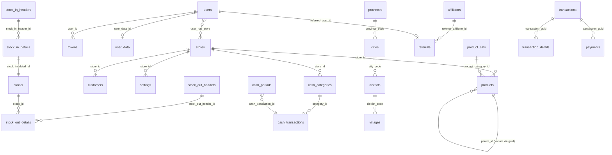
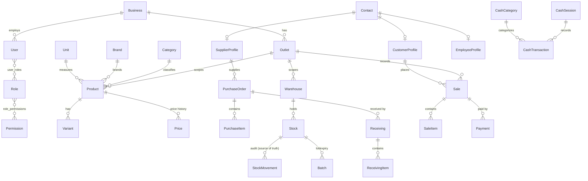
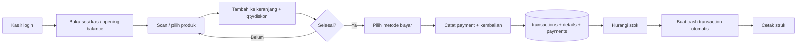
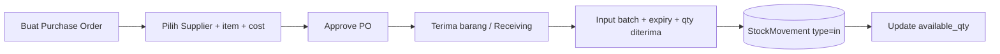

# Analisis Database: Mangkasir (mpos) vs Eqiozmart

> **Inti tugas:** Menilai apakah database aplikasi lama mentor (**Mangkasir** = dump `mpos.sql` + `mpos_transaction.sql`) **sudah memenuhi** kebutuhan klon baru (**Eqiozmart**, sesuai spec di repo ini), atau belum.
>
> Dokumen ini berisi: **ERD existing**, **ERD target**, **user flow**, dan **gap analysis** lengkap dalam satu file.

---

## 1. Ringkasan Eksekutif (Verdict)

**Status: MEMENUHI SEBAGIAN (~60%).** Database Mangkasir sudah solid untuk **POS inti** (produk, stok, penjualan, kas, pelanggan) dan bisa langsung dipakai sebagai basis. Namun **belum memenuhi** beberapa konteks yang dijanjikan spec Eqiozmart.

| Verdict per pilar | Status | Catatan |
|---|---|---|
| Penjualan / POS (Sales) | ✅ Memenuhi | `transactions`, `transaction_details`, `payments` lengkap |
| Produk (Product) | 🟡 Sebagian | Ada produk + kategori, **tapi tanpa Brand, Unit (master), Variant terstruktur, Price-history** |
| Inventory / Stok | ✅ Memenuhi | Stock-in/out header-detail + batch + expiry sudah ada |
| Kas / Finance | ✅ Memenuhi | `cash_transactions`, `cash_categories`, `cash_periods` ada |
| Pelanggan (CRM) | 🟡 Sebagian | `customers` ada, **tapi tidak ada Supplier & model Contact terpadu** |
| **Pembelian (Purchase)** | ❌ **Tidak ada** | **Tidak ada `suppliers`, `purchase_orders`, `receiving`** — gap terbesar |
| Multi-tenant (Organization) | 🟡 Sebagian | Hanya `stores` flat + `user_has_store`; **tidak ada entitas `Business`/Tenant di atas Outlet** |
| Identity / RBAC | 🟡 Sebagian | Auth ada (`users`, `tokens`, `otp`), **tapi role hanya ENUM**, bukan tabel Role/Permission |
| Settings | ✅ Memenuhi | Tabel `settings` (key-value per store) cukup |
| Reporting | ✅ N/A | Tepat — read-model, tak perlu tabel transaksional |

**Tiga gap yang wajib ditutup sebelum klon dianggap setara spec:**
1. **Modul Purchase** (supplier, PO, penerimaan barang) — sama sekali absen.
2. **Lapisan Tenant `Business`** di atas `stores` untuk multi-tenant sejati.
3. **RBAC tabel** (Role/Permission M:N) menggantikan `users.role` ENUM.

---

## 2. ERD — Database Existing (Mangkasir / mpos)

> Dua database fisik: `mpos` (master + inventory + kas) dan `mpos_transaction` (penjualan). Dipisah by design — relasi lintas-DB lewat `guid`/`store_id`, **bukan FK** (cross-DB FK tidak mungkin di MySQL).

**Tabel `mpos` (master):** affiliators, cash_categories, cash_periods, cash_transactions, cities, contact_us, customers, districts, faqs, file_uploads, guides, otp_verifications, products, product_cats, provinces, referrals, settings, stocks, stock_in_details, stock_in_headers, stock_out_details, stock_out_headers, stores, tokens, users, user_data, user_has_store, villages.

**Tabel `mpos_transaction`:** transactions, transaction_details, payments.

**Catatan kunci skema existing:**
- Audit kolom konsisten di semua tabel: `createdAt/By`, `updatedAt/By`, `deleted` (boolean, **bukan** soft-delete timestamp seperti yang diminta spec).
- `products.guid` adalah kunci publik; relasi stok/transaksi pakai `product_guid` (string), bukan `product_id`.
- Varian produk = self-reference `products.parent_id → products.guid` (model "flat dengan induk"), bukan tabel `variants` terpisah.
- `products.qty` + tabel `stocks` = stok disimpan dua tempat (denormalisasi + sumber batch). `is_use_stock`/`is_stock` mengatur apakah produk dilacak stok.

---

## 3. ERD — Target Eqiozmart (dari Spec)

**11 Bounded Context target:** Identity, Organization, Product, CRM, Purchase, Inventory, Sales, Finance, Reporting, Settings, (+Online Store opsional).

---

## 4. User Flow Utama

### 4.1 Penjualan (Checkout POS) — *ada di kedua sistem*

> Di Mangkasir: H→`mpos_transaction`, I→update `products.qty`/`stocks`, J→`cash_transactions`. Di Eqiozmart spec: langkah I/J jalan via **Domain Event** `SaleCompleted` dalam satu transaksi DB.

### 4.2 Pembelian (Restock dari Supplier) — *HANYA di Eqiozmart, GAP di Mangkasir*

> ⚠️ Di Mangkasir flow ini **tidak terwakili penuh**. Yang ada hanya `stock_in_headers/details` (penambahan stok manual) — **tanpa supplier, tanpa PO, tanpa proses approval**. Stok masuk seakan "muncul" tanpa jejak pembelian.

### 4.3 Manajemen Kas Harian — *ada di kedua sistem*

---

## 5. Gap Analysis Detail (per Modul)

Legenda: ✅ ada & cukup · 🟡 ada tapi kurang · ❌ tidak ada

### 5.1 Identity & Auth
| Kebutuhan Eqiozmart | Di Mangkasir | Status |
|---|---|---|
| User + login + password hash | `users` | ✅ |
| Refresh token / sesi | `tokens` | ✅ |
| OTP verifikasi | `otp_verifications` | ✅ |
| Role sebagai **tabel** | `users.role` ENUM (`Administrator/Kasir/Owner`) | 🟡 |
| Permission granular (mis. `PRODUCT_CREATE`) M:N | — | ❌ |
| Profil user | `user_data` (+ wilayah) | ✅ |

**Aksi:** tambah tabel `roles`, `permissions`, `role_permissions`, `user_roles`. Pertahankan `users`/`tokens`/`otp` apa adanya.

### 5.2 Organization (Multi-tenant)
| Kebutuhan | Di Mangkasir | Status |
|---|---|---|
| Tenant root **Business** di atas outlet | — (hanya `stores` flat) | ❌ |
| Outlet / toko | `stores` | ✅ (jadi Outlet) |
| User ↔ outlet | `user_has_store` (M:N) | ✅ |
| Pengaturan per outlet | `settings` | ✅ |

**Aksi:** tambah `businesses` (tenant), tambahkan `stores.business_id`. Tanpa ini, multi-tenant Eqiozmart tidak bisa mengisolasi banyak bisnis.

### 5.3 Product
| Kebutuhan | Di Mangkasir | Status |
|---|---|---|
| Produk + SKU + barcode + harga + cost | `products` | ✅ |
| Kategori | `product_cats` | ✅ |
| **Brand** (master) | — | ❌ |
| **Unit** (master tabel) | `products.unit` (string bebas) | 🟡 |
| **Variant** (tabel terpisah) | self-ref `parent_id` | 🟡 |
| **Price history** (tabel `prices`) | harga inline di `products` | 🟡 |

**Aksi:** opsional untuk MVP. Brand/Unit master & Price-history adalah peningkatan; varian self-ref sudah jalan walau kurang rapi.

### 5.4 CRM (Kontak)
| Kebutuhan | Di Mangkasir | Status |
|---|---|---|
| Customer | `customers` | ✅ |
| **Supplier** | — | ❌ |
| Model **Contact** terpadu (customer/supplier/employee) | — (hanya customer) | 🟡 |
| Loyalty point / credit limit | — | ❌ |

**Aksi:** minimal tambah `suppliers` (atau adopsi model `contacts` + profile). Supplier wajib karena dipakai modul Purchase.

### 5.5 Purchase — **GAP TERBESAR**
| Kebutuhan | Di Mangkasir | Status |
|---|---|---|
| Purchase Order (header) | — | ❌ |
| Purchase Item (detail) | — | ❌ |
| Receiving / penerimaan barang | sebagian via `stock_in_headers` | 🟡 |
| Purchase Return | — | ❌ |
| Status PO (draft/approved/cancelled) | — | ❌ |

**Aksi (wajib):** buat `purchase_orders`, `purchase_items`, `receivings`, `receiving_items`. Hubungkan `stock_in_*` yang sudah ada sebagai hasil dari Receiving.

### 5.6 Inventory
| Kebutuhan | Di Mangkasir | Status |
|---|---|---|
| Stok masuk header-detail | `stock_in_headers/details` | ✅ |
| Stok keluar header-detail | `stock_out_headers/details` | ✅ |
| Batch + expiry | `stock_in_details.batch_number/expiry_date` | ✅ |
| Saldo stok per produk | `stocks` + `products.qty` | ✅ |
| **Warehouse** sebagai entitas | — (stok melekat ke store, bukan gudang) | 🟡 |
| **StockMovement** ledger tunggal (source of truth) | terpecah in/out + `stocks` | 🟡 |
| Transfer antar-gudang | — | ❌ |
| Stock opname / adjustment terstruktur | `type` di header (generik) | 🟡 |

**Aksi:** secara fungsional sudah cukup untuk MVP. Untuk setara spec: tambah `warehouses` dan/atau satukan pergerakan ke satu `stock_movements`.

### 5.7 Sales (POS)
| Kebutuhan | Di Mangkasir | Status |
|---|---|---|
| Transaksi penjualan + invoice | `transactions` | ✅ |
| Item penjualan | `transaction_details` | ✅ |
| Pembayaran (multi-metode) | `payments` | ✅ |
| Diskon & PPN (invoice + item) | `invoice_discount`, `invoice_ppn`, `discount`, `ppn` | ✅ |
| HPP/cost per item (untuk profit) | `transaction_details.cost`, `stock_in_id` | ✅ |
| Status transaksi | `transactions.flag` (default `done`) | ✅ |
| Sale Return | — | ❌ |

**Aksi:** modul paling matang. Hanya kurang **retur penjualan**.

### 5.8 Finance (Kas)
| Kebutuhan | Di Mangkasir | Status |
|---|---|---|
| Transaksi kas debit/kredit | `cash_transactions` | ✅ |
| Kategori kas | `cash_categories` (type income/expense) | ✅ |
| Periode / tutup kas | `cash_periods` | ✅ |
| Cash session per kasir (opening/closing) | model periode (bukan per-sesi-kasir) | 🟡 |

**Aksi:** cukup untuk MVP. Spec ingin `cash_sessions` per kasir; `cash_periods` mendekati tapi beda granularitas.

### 5.9 Settings & Reporting
| Kebutuhan | Di Mangkasir | Status |
|---|---|---|
| Setting key-value per outlet | `settings` | ✅ |
| Printer / receipt template | belum (bisa lewat `settings`) | 🟡 |
| Reporting | — (read-model dari data) | ✅ N/A |

---

## 6. Perbedaan Konvensi Penting (Existing vs Spec)

| Aspek | Mangkasir (existing) | Spec Eqiozmart | Dampak |
|---|---|---|---|
| Soft delete | `deleted` boolean | `deleted_at` timestamp + `deleted_by` | Perlu migrasi kolom bila ikut spec |
| ID publik | `guid` (varchar) di sebagian tabel | `uuid` konsisten semua tabel | Standarisasi |
| Relasi produk | by `product_guid` (string) | by `product_id` (FK) | Integritas referensial lebih lemah di existing |
| Multi-DB | 2 database (`mpos` + `mpos_transaction`) | 1 database, partisi logis per domain | Spec backend = single DB |
| Stok | denormalisasi (`products.qty` + `stocks`) | `Stock` proyeksi, `StockMovement` source of truth | Konsistensi |
| RBAC | ENUM role | tabel Role/Permission | Fleksibilitas izin |

> Catatan: CLAUDE.md menyebut kontradiksi **MySQL vs Prisma/Postgres** di spec. Database existing = **MariaDB/MySQL**. Jika klon meneruskan basis ini, **pilih MySQL** dan abaikan referensi Postgres — selesaikan kontradiksi ini sebelum menulis migrasi.

---

## 7. Kesimpulan & Rekomendasi

**Jawaban untuk mentor:** Database Mangkasir **belum sepenuhnya memenuhi** spec Eqiozmart, tetapi **layak dijadikan fondasi**. Inti POS (jual–stok–kas–pelanggan) sudah matang dan teruji. Yang hilang adalah modul-modul "hulu" dan struktur multi-tenant/RBAC.

**Roadmap penutupan gap (urut prioritas):**
1. **Wajib** — Tambah modul **Purchase**: `suppliers`, `purchase_orders`, `purchase_items`, `receivings`. (Gap fungsional terbesar.)
2. **Wajib** — Tambah lapisan **Business** (tenant) di atas `stores`.
3. **Wajib** — RBAC: tabel `roles`, `permissions`, `role_permissions`, `user_roles`.
4. **Disarankan** — Sale Return & Purchase Return.
5. **Disarankan** — Master `brands`, `units`, dan `prices` (history).
6. **Disarankan** — Entitas `warehouses` + satukan `stock_movements`.
7. **Opsional/standarisasi** — Soft-delete timestamp, `uuid` konsisten, satukan 2 DB → 1.

Dengan menutup poin 1–3, klon Eqiozmart sudah **setara fungsional** dengan janji spec untuk MVP.

---

## Related Database
- [Conceptual Data Model](07_Conceptual_Data_Model.md)
- [Logical Data Model](08_Logical_Data_Model.md)
- [Physical Database Design](09_Physical_Database_Design.md)

## References
- `mpos.sql`, `mpos_transaction.sql` (dump Mangkasir, 2026-06-26)
- `02_Architecture/04_Bounded_Context_And_Domain_Model.md`
- `glossary.md`
